# <h1 align="center">Laporan Praktikum Modul 02 <br> Review Pengenalan Pemrograman </h1>
<p align="center">Nabella Rahmatus Sania - 103112430002</p>

## Dasar Teori

Golang (Go) adalah bahasa pemrograman dari Google yang cepat, dan efisien. Bahasa ini memiliki sintaks sederhana, serta struktur dasar berupa _package_, _import_, dan fungsi `main()`. Golang mendukung berbagai tipe data, kontrol alur dengan _if-else_ dan _for loop_, serta penggunaan fungsi untuk pemrograman modular. Dengan performa tinggi dan kemudahan penggunaan, Golang banyak dipakai dalam pengembangan sistem, layanan web, dan aplikasi berskala besar.

## Unguided

### Latihan Soal 2A
---

#### Soal 1
Telusuri program berikut dengan cara mengkompilasi dan mengeksekusi program. Silakan masukan data yang sesuai sebanyak yang diminta program. Perhatikan keluaran yang diperoleh. Coba terangkan apa sebenarnya yang dilakukan program tersebut?

```go
package main

  

import "fmt"

  

func main() {

var (

satu, dua, tiga string

temp string

)

  

fmt.Print("Masukan input string: ")

fmt.Scanln(&satu)

  

fmt.Print("Masukan input string: ")

fmt.Scanln(&dua)

  

fmt.Print("Masukan input string: ")

fmt.Scanln(&tiga)

  

fmt.Println("Output awal = " + satu + " " + dua + " " + tiga)

  

temp = satu

satu = dua

dua = tiga

tiga = temp

  

fmt.Println("Output akhir = " + satu + " " + dua + " " + tiga)

}
```

> Output
> 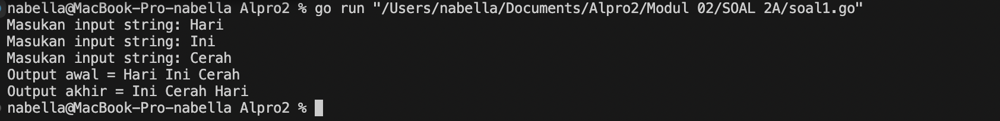

Program ini meminta pengguna untuk memasukkan tiga kata satu per satu. Setelah semua kata dimasukkan, program akan menampilkan urutan awal sesuai dengan input yang diberikan. Kemudian, program mengubah posisi kata-kata tersebut dengan cara menggesernya ke kiri. Kata pertama dipindahkan ke posisi terakhir, kata kedua pindah ke posisi pertama, dan kata ketiga berpindah ke posisi kedua. Setelah proses pertukaran selesai, program menampilkan urutan baru dari ketiga kata tersebut. Dengan kata lain, program ini hanya mengubah susunan kata agar bergeser ke kiri secara melingkar.

#### Soal 2
Tahun kabisat adalah tahun yang habis dibagi 400 atau habis dibagi 4 tetapi tidak habis dibagi 100. Buatlah sebuah program yang menerima input sebuah bilangan bulat dan memeriksa apakah bilangan tersebut merupakan tahun kabisat (true) atau bukan (false).

```go
package main

  

import "fmt"

  

func main() {

  

var tahun int

var kabisat bool

  

fmt.Print("Masukan tahun: ")

fmt.Scanln(&tahun)

  

if tahun%400 == 0 || tahun%4 == 0 && tahun%100 != 0 {

kabisat = true

} else {

kabisat = false

}

  

fmt.Println("Tahun:", tahun)

fmt.Println("Kabisat:", kabisat)

  

}
```

> Output
> 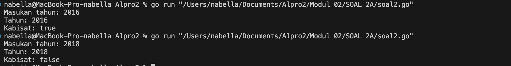

Program ini mengecek apakah suatu tahun adalah tahun kabisat atau tidak. Pengguna memasukkan tahun, lalu program menentukan apakah tahun tersebut kabisat berdasarkan aturan: habis dibagi 400 atau habis dibagi 4 tetapi tidak habis dibagi 100. Hasilnya ditampilkan sebagai `true` jika kabisat dan `false` jika bukan.

#### Soal 3
Buat program Bola yang menerima input jari-jari suatu bola (bilangan bulat). Tampilkan Volume dan Luas kulit bola. 𝑣𝑜𝑙𝑢𝑚𝑒𝑏𝑜𝑙𝑎 = 4 3 𝜋𝑟 3 dan 𝑙𝑢𝑎𝑠𝑏𝑜𝑙𝑎 = 4𝜋𝑟 2 (π ≈ 3.1415926535).

```go
package main

  

import (

"fmt"

"math"

)

  

func main() {

const pi = 3.1415926535

  

var r int

fmt.Print("Jejari = ")

fmt.Scanln(&r)

  

volume := (4.0 / 3.0) * pi * math.Pow(float64(r), 3)

  

luas := 4 * pi * math.Pow(float64(r), 2)

  

fmt.Printf("Bola dengan jejari %d memiliki volume %.4f dan luas kulit %.4f.\n", r, volume, luas)

}
```

> Output
> 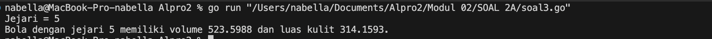

Program ini menghitung volume dan luas permukaan bola berdasarkan jejari (radius) yang dimasukkan oleh pengguna. Pertama, pengguna diminta memasukkan nilai jejari, lalu program mengonversinya ke tipe data `float64` agar bisa digunakan dalam perhitungan matematika. Volume bola dihitung dengan rumus 43πr3\frac{4}{3} \pi r^3, sedangkan luas permukaannya dihitung dengan rumus 4πr24 \pi r^2. Hasil perhitungan kemudian ditampilkan dengan empat angka di belakang desimal untuk memastikan ketelitian.

#### Soal 4
Dibaca nilai temperatur dalam derajat Celsius. Nyatakan temperatur tersebut dalam Fahrenheit 𝐶𝑒𝑙𝑠𝑖𝑢𝑠 = (𝐹𝑎ℎ𝑟𝑒𝑛ℎ𝑒𝑖𝑡 − 32) × 5/9 𝑅𝑒𝑎𝑚𝑢𝑟 = 𝐶𝑒𝑙𝑐𝑖𝑢𝑠 × 4/5 𝐾𝑒𝑙𝑣𝑖𝑛 = (𝐹𝑎ℎ𝑟𝑒𝑛ℎ𝑒𝑖𝑡 + 459.67) × 5/9

```go
package main

  

import (

"fmt"

)

  

func main() {

var celsius float64

  

fmt.Print("Masukkan suhu dalam Celsius: ")

fmt.Scanln(&celsius)

  

fahrenheit := (celsius * 9 / 5) + 32

reamur := celsius * 4 / 5

kelvin := celsius + 273.15

  

fmt.Printf("Suhu dalam Fahrenheit: %.2f\n", fahrenheit)

fmt.Printf("Suhu dalam Reamur: %.2f\n", reamur)

fmt.Printf("Suhu dalam Kelvin: %.2f\n", kelvin)

}

```

>Output
> 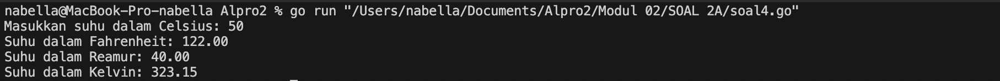

Program ini berfungsi untuk mengonversi suhu dari Celsius ke tiga skala suhu lainnya, yaitu Fahrenheit, Reamur, dan Kelvin. Pertama, pengguna diminta memasukkan suhu dalam derajat Celsius. Program kemudian melakukan perhitungan dengan rumus: Fahrenheit = (C×95)+32(C \times \frac{9}{5}) + 32, Reamur = C×45C \times \frac{4}{5}, dan Kelvin = C+273.15C + 273.15. Hasil konversi ditampilkan dalam format desimal dengan dua angka di belakang koma untuk memastikan ketelitian. Dengan program ini, pengguna bisa dengan mudah mengetahui suhu dalam berbagai satuan hanya dengan memasukkan satu nilai dalam Celsius.

#### Soal 5
Tipe karakter sebenarnya hanya apa yang tampak dalam tampilan. Di dalamnya tersimpan dalam bentuk biner 8 bit (byte) atau 32 bit (rune) saja. Buat program ASCII yang akan membaca 5 buat data integer dan mencetaknya dalam format karakter. Kemudian membaca 3 buah data karakter dan mencetak 3 buah karakter setelah karakter tersebut (menurut tabel ASCII). Masukan terdiri dari dua baris. Baris pertama berisi 5 buah data integer. Data integer mempunyai nilai antara 32 s.d. 127. Baris kedua berisi 3 buah karakter yang berdampingan satu dengan yang lain (tanpa dipisahkan spasi). Keluaran juga terdiri dari dua baris. Baris pertama berisi 5 buah representasi karakter dari data yang diberikan, yang berdampingan satu dengan lain, tanpa dipisahkan spasi. Baris kedua berisi 3 buah karakter (juga tidak dipisahkan oleh spasi).

```go
package main

  

import "fmt"

  

func main() {

var (

c1, c2, c3, c4, c5 byte

b1, b2, b3 int

)

  

fmt.Scan(&c1, &c2, &c3, &c4, &c5)

fmt.Scanf("%c", &b1)

fmt.Scanf("%c", &b2)

fmt.Scanf("%cc", &b3)

  

fmt.Printf("%c%c%c%c%c\n", c1, c2, c3, c4, c5)

fmt.Printf("%c %c %c\n", b1+1, b2+1, b3+1)

}
```

Output
> 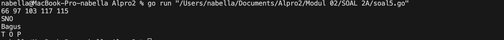

Program ini membaca lima karakter pertama sebagai input dan menyimpannya dalam variabel `c1` hingga `c5`. Kemudian, program membaca tiga karakter tambahan yang disimpan dalam variabel `b1`, `b2`, dan `b3`. Setelah itu, program mencetak lima karakter pertama secara berurutan. Selanjutnya, program mencetak tiga karakter tambahan yang telah dikonversi dengan menambahkan nilai 1 ke dalamnya, serta menampilkan mereka dengan spasi di antara setiap karakter. Hal ini memungkinkan pengguna untuk melihat hasil perubahan nilai ASCII dari karakter yang dimasukkan.

### Latihan Soal 2B
---
#### Soal 1
Siswa kelas IPA di salah satu sekolah menengah atas di Indonesia sedang mengadakan praktikum kimia. Di setiap percobaan akan menggunakan 4 tabung reaksi, yang mana susunan warna cairan di setiap tabung akan menentukan hasil percobaan. Siswa diminta untuk mencatat hasil percobaan tersebut. Percobaan dikatakan berhasil apabila susunan warna zat cair pada gelas 1 hingga gelas 4 secara berturutan adalah ‘merah’, ‘kuning’, ‘hijau’, dan ‘ungu’ selama 5 kali percobaan berulang.

Buatlah sebuah program yang menerima input berupa warna dari ke 4 gelas reaksi sebanyak 5 kali percobaan. Kemudian program akan menampilkan true apabila urutan warna sesuai dengan informasi yang diberikan pada paragraf sebelumnya, dan false untuk urutan warna lainnya.

```go
package main

  

import (

"fmt"

)

  

func main() {

var a, b, c, d string

warna := true

  

for i := 1; i <= 5; i++ {

fmt.Printf("Percobaan %d: ", i)

fmt.Scan(&a, &b, &c, &d)

  

if a != "merah" || b != "kuning" || c != "hijau" || d != "ungu" {

warna = false

}

}

fmt.Println("BERHASIL: ", warna)

}
```

>Output
> 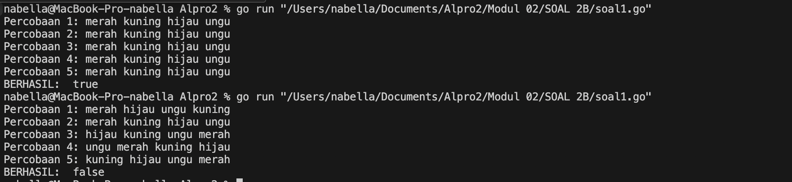

Program ini meminta pengguna untuk memasukkan empat warna sebanyak lima kali dalam sebuah loop. Pada setiap iterasi, program membaca empat kata yang dimasukkan pengguna dan menyimpannya dalam variabel `a`, `b`, `c`, dan `d`. Jika keempat warna yang dimasukkan tidak sesuai dengan urutan "merah", "kuning", "hijau", dan "ungu" pada salah satu percobaan, maka variabel `warna` diubah menjadi `false`. Setelah lima percobaan selesai, program mencetak "BERHASIL: true" jika semua input sesuai dengan urutan warna yang diharapkan dalam setiap percobaan, atau "BERHASIL: false" jika ada setidaknya satu percobaan yang tidak sesuai.

#### Soal 2
Suatu pita (string) berisi kumpulan nama-nama bunga yang dipisahkan oleh spasi dan ‘– ‘, contoh pita diilustrasikan seperti berikut ini.
Pita: mawar – melati – tulip – teratai – kamboja – anggrek
Buatlah sebuah program yang menerima input sebuah bilangan bulat positif (dan tidak nol) N, kemudian program akan meminta input berupa nama bunga secara berulang sebanyak N kali dan nama tersebut disimpan ke dalam pita. Modifikasi program sebelumnya, proses input akan berhenti apabila user mengetikkan ‘SELESAI’. Kemudian tampilkan isi pita beserta banyaknya bunga yang ada di dalam pita

```go
package main

  

import "fmt"

  

func main() {

  

var bunga, pita string

var jumlah int

  

jumlah = 0

  

for {

  

fmt.Print("Bunga ", jumlah+1, ": ")

fmt.Scan(&bunga)

  

if bunga == "selesai" {

break

}

  

pita = pita + bunga + " - "

jumlah++

  

}

  

fmt.Println("Pita:", pita)

fmt.Println("Bunga:", jumlah)

  

}
```

>Output
> 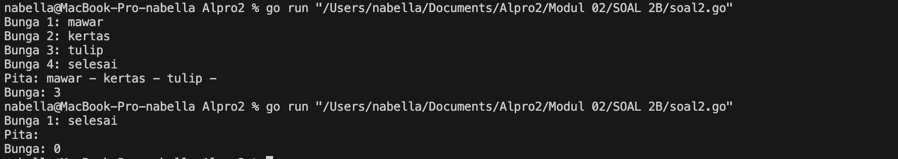

Program ini meminta pengguna untuk memasukkan nama bunga satu per satu. Setiap nama bunga yang dimasukkan akan ditambahkan ke dalam variabel `pita` dengan format " - ". Program akan terus meminta input hingga pengguna mengetik "selesai", yang akan menghentikan loop. Setelah loop berhenti, program mencetak daftar bunga yang telah dimasukkan dalam bentuk satu string dengan tanda pemisah " - " dan menampilkan jumlah bunga yang telah dimasukkan.

#### Soal 3
Setiap hari Pak Andi membawa banyak barang belanjaan dari pasar dengan mengendarai sepeda motor. Barang belanjaan tersebut dibawa dalam kantong terpal di kiri-kanan motor. Sepeda motor tidak akan oleng jika selisih berat barang di kedua kantong sisi tidak lebih dari 9 kg. Buatlah program Pak Andi yang menerima input dua buah bilangan real positif yang menyatakan berat total masing-masing isi kantong terpal. Program akan terus meminta input bilangan tersebut hingga salah satu kantong terpal berisi 9 kg atau lebih. Pada modifikasi program tersebut, program akan menampilkan true jika selisih kedua isi kantong lebih dari atau sama dengan 9 kg. Program berhenti memproses apabila total berat isi kedua kantong melebihi 150 kg atau salah satu kantong beratnya negatif.

```go
package main

  

import (

"fmt"

"math"

)

  

func main() {

var beratKiri, beratKanan float64

  

for {

fmt.Print("Masukan berat belanjaan di kedua kantong: ")

fmt.Scanln(&beratKiri, &beratKanan)

  

if beratKiri < 0 || beratKanan < 0 {

fmt.Println("Proses selesai.")

break

}

if beratKiri+beratKanan > 150 {

fmt.Println("Proses selesai.")

break

}

  

oleng := math.Abs(beratKiri-beratKanan) >= 9

fmt.Printf("Sepeda motor pak Andi akan oleng: %t\n", oleng)

}

}
```

>Output
> 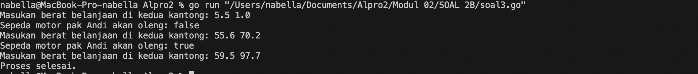

Program ini digunakan untuk mengecek apakah sepeda motor Pak Andi akan oleng (miring) berdasarkan berat belanjaan yang dimasukkan pada dua kantong. Pengguna diminta memasukkan berat belanjaan untuk kantong kiri dan kanan. Program akan terus meminta input hingga salah satu dari dua kondisi berikut terpenuhi:

1. Ada berat negatif yang dimasukkan (menandakan proses selesai).
2. Total berat belanjaan di kedua kantong melebihi 150 kg (karena terlalu berat).

Setiap kali pengguna memasukkan berat yang valid, program akan menghitung perbedaan berat antara kedua kantong. Jika selisihnya 9 kg atau lebih, program mencetak "Sepeda motor pak Andi akan oleng: true", jika tidak, mencetak "false". Program ini memastikan keseimbangan beban pada sepeda motor agar tetap stabil.

#### Soal 4
Diberikan sebuah persamaan sebagai berikut ini. 𝑓(𝑘) = (4𝑘 + 2) 2 (4𝑘 + 1)(4𝑘 + 3) Buatlah sebuah program yang menerima input sebuah bilangan sebagai K, kemudian menghitung dan menampilkan nilai f(K) sesuai persamaan di atas.

```go
package main

  

import (

"fmt"

"math"

)

  

func main() {

var k int

  

fmt.Print("Nilai K: ")

fmt.Scan(&k)

  

result := 1.0

  

for i := 0; i < k; i++ {

numerator := math.Pow(float64(4*i+2), 2)

denumerator := float64((4*i + 1) * (4*i + 3))

result *= numerator / denumerator

}

  

fmt.Printf("Hasil dari operasi fungsi = %.10f\n", result)

}
```

>Output
> 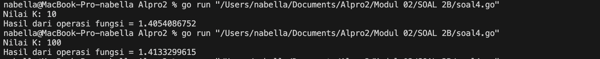

Program ini menghitung hasil dari sebuah operasi matematika berdasarkan input `k`. Dimulai dengan `result = 1.0`, lalu dalam `k` kali perulangan, program menghitung pecahan dengan rumus tertentu dan mengalikannya ke `result`. Setelah perhitungan selesai, hasil akhirnya ditampilkan dengan 10 angka di belakang desimal.

### Latihan Soal 2C
---
#### Soal 1
PT POS membutuhkan aplikasi perhitungan biaya kirim berdasarkan berat parsel. Maka, buatlah program BiayaPos untuk menghitung biaya pengiriman tersebut dengan ketentuan sebagai berikut! Dari berat parsel (dalam gram), harus dihitung total berat dalam kg dan sisanya (dalam gram). Biaya jasa pengiriman adalah Rp. 10.000,- per kg. Jika sisa berat tidak kurang dari 500  gram, maka tambahan biaya kirim hanya Rp. 5,- per gram saja. Tetapi jika kurang dari 500 gram, maka tambahan biaya akan dibebankan sebesar Rp. 15,- per gram. Sisa berat (yang kurang dari 1kg) digratiskan biayanya apabila total berat ternyata lebih dari 10kg.

```go
package main

  

import (

"fmt"

)

  

func main() {

var beratParsel int

fmt.Print("Berat parsel (gram): ")

fmt.Scanln(&beratParsel)

  

beratKg := beratParsel / 1000

sisaGram := beratParsel % 1000

  

biayaPerKg := 10000

biayaTotal := beratKg * biayaPerKg

biayaSisa := 0

  

if beratKg > 10 {

biayaSisa = 0

} else {

if sisaGram >= 500 {

biayaSisa = sisaGram * 5

} else {

biayaSisa = sisaGram * 15

}

}

  

totalBiaya := biayaTotal + biayaSisa

  

fmt.Printf("Detail berat: %d kg + %d gr\n", beratKg, sisaGram)

fmt.Printf("Detail biaya: Rp. %d + Rp. %d\n", biayaTotal, biayaSisa)

fmt.Printf("Total biaya: Rp. %d\n", totalBiaya)

}
```

>Output
> 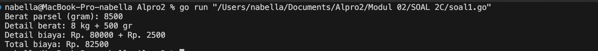

Program ini menghitung biaya pengiriman parsel berdasarkan beratnya dalam gram. Berat dikonversi ke kilogram dan gram sisa, lalu biaya dasar dihitung Rp. 10.000 per kg. Jika berat lebih dari 10 kg, tidak ada biaya tambahan untuk sisa gram. Jika sisa gram ≥ 500, biayanya Rp. 5 per gram, sedangkan jika kurang, biayanya Rp. 15 per gram. Hasil akhirnya menampilkan rincian berat dan total biaya yang harus dibayar.

#### Soal 2
Jika nam diberikan adalah 80.1, apa keluaran dari program tersebut? Apakah eksekusi program tersebut sesuai spesifikasi soal?
Apa saja kesalahan dari program tersebut? Mengapa demikian? Jelaskan alur program seharusnya!
Perbaiki program tersebut! Ujilah dengan masukan: 93.5; 70.6; dan 49.5. Seharusnya keluaran yang diperoleh adalah ‘A’, ‘B’, dan ‘D’.

Kode yang sudah diperbaiki 
```go
package main

  

import "fmt"

  

func main() {

var nam float64

var nmk string

fmt.Print("Nilai akhir mata kuliah: ")

fmt.Scan(&nam)

  

if nam > 80 {

nmk = "A"

} else if nam > 72.5 {

nmk = "AB"

} else if nam > 65 {

nmk = "B"

} else if nam > 57.5 {

nmk = "BC"

} else if nam > 50 {

nmk = "C"

} else if nam > 40 {

nmk = "D"

} else {

nmk = "E"

}

  

fmt.Println("Nilai mata kuliah:", nmk)

}
```

>Output
> 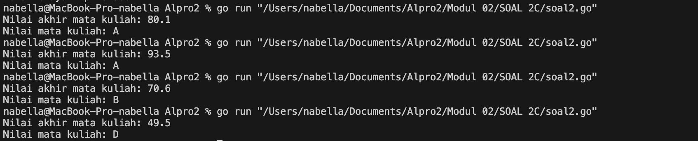

Output program untuk input 80.1
 - Terjadi Kesalahan dalam variabel, variabel nam yang seharusnya adalah variabel nmk (Output program adalah Nilai Mata Kuliah :A)
 Kesalahan Program
 - Kesalahan dalam variabel, untuk output seharusnya menggunakan variabel nmk, bukan nam
 - Program memeriksa kondisi dengan urutan yang salah
- Program menggunakan if tanpa else, yang membuat program memeriksa kondisi yang sudah terpenuhi.

#### Soal 3
Sebuah bilangan bulat b memiliki faktor bilangan f > 0 jika f habis membagi b. Contoh: 2 merupakan faktor dari bilangan 6 karena 6 habis dibagi 2. Buatlah program yang menerima input sebuah bilangan bulat b dan b > 1. Program harus dapat mencari dan menampilkan semua faktor dari bilangan tersebut! Bilangan bulat b > 0 merupakan bilangan prima p jika dan hanya jika memiliki persis dua faktor bilangan saja, yaitu 1 dan dirinya sendiri. Lanjutkan program sebelumnya. Setelah menerima masukan sebuah bilangan bulat b > 0. Program tersebut mencari dan menampilkan semua faktor bilangan tersebut. Kemudian, program menentukan apakah b merupakan bilangan prima.

```go
package main

  

import (

"fmt"

)

  

func main() {

var b int

fmt.Print("Bilangan: ")

fmt.Scan(&b)

  

if b <= 1 {

fmt.Println("Input harus lebih besar dari 1.")

return

}

  

fmt.Print("Faktor: ")

count := 0

  

for i := 1; i <= b; i++ {

if b%i == 0 {

fmt.Print(i, " ")

count++

}

}

fmt.Println()

  

if count == 2 {

fmt.Println("Prima: true")

} else {

fmt.Println("Prima: false")

}

}

```

>Output
> 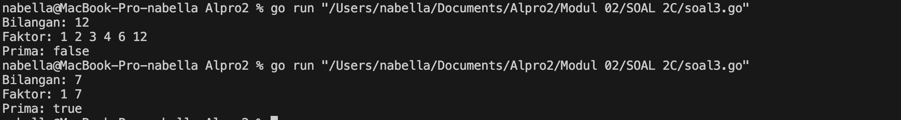

Program ini berfungsi untuk menampilkan faktor-faktor dari suatu bilangan dan menentukan apakah bilangan tersebut adalah bilangan prima. Pertama, program meminta pengguna memasukkan sebuah bilangan, lalu mengecek apakah bilangan tersebut lebih besar dari 1. Jika tidak, program akan menampilkan pesan kesalahan dan berhenti. Selanjutnya, program mencari faktor-faktor bilangan tersebut dengan melakukan iterasi dari 1 hingga bilangan itu sendiri dan mencetak faktor yang ditemukan. Program juga menghitung jumlah faktor, lalu menentukan apakah bilangan tersebut prima. Jika hanya memiliki dua faktor (1 dan bilangan itu sendiri), bilangan dianggap prima, sedangkan jika memiliki lebih dari dua faktor, bilangan bukan prima.