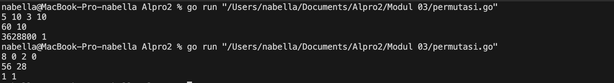
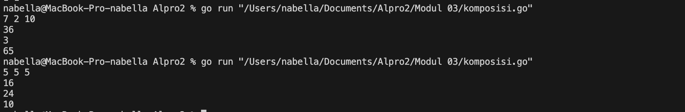
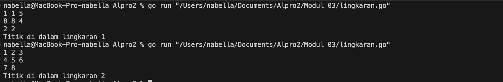

# <h1 align="center">Laporan Praktikum Modul 03<br> Fungsi</h1>
<p align="center">Nabella Rahmatus Sania - 103112430002</p>

## Dasar Teori

Fungsi dalam Golang adalah blok kode yang dapat digunakan kembali untuk menjalankan tugas tertentu. Dideklarasikan dengan func, fungsi bisa memiliki parameter dan nilai balik. Ini membantu membuat kode lebih terstruktur, modular, dan mudah dipahami.

## Unguided

### Soal 1

Minggu ini, mahasiswa Fakultas Informatika mendapatkan tugas dari mata kuliah matematika diskrit untuk mempelajari kombinasi dan permutasi. Jonas salah seorang mahasiswa, iseng untuk mengimplementasikannya ke dalam suatu program. Oleh karena itu bersediakah kalian membantu Jonas? (tidak tentunya ya :p)
Masukan terdiri dari empat buah bilangan asli 𝑎, 𝑏, 𝑐, dan 𝑑 yang dipisahkan oleh spasi, dengan syarat 𝑎 ≥ 𝑐 dan 𝑏 ≥ 𝑑.
Keluaran terdiri dari dua baris. Baris pertama adalah hasil permutasi dan kombinasi 𝒂 terhadap 𝑐, sedangkan baris kedua adalah hasil permutasi dan kombinasi 𝑏 terhadap 𝑑.
Catatan: permutasi (P) dan kombinasi (C) dari 𝑛 terhadap 𝑟 (𝑛 ≥ 𝑟) dapat dihitung dengan menggunakan persamaan berikut!
𝑃 (𝑛, 𝑟) = 𝑛! / (𝑛−𝑟)! , sedangkan 𝐶 (𝑛, 𝑟) = 𝑛! / 𝑟!(𝑛−𝑟)!

```go
package main

  

import (

"fmt"

)

  

func faktorial(n int) int {

hasil := 1

for i := 2; i <= n; i++ {

hasil *= i

}

return hasil

}

  

func permutasi(n, r int) int {

return faktorial(n) / faktorial(n-r)

}

  

func kombinasi(n, r int) int {

return faktorial(n) / (faktorial(r) * faktorial(n-r))

}

  

func main() {

var a, b, c, d int

fmt.Scan(&a, &b, &c, &d)

fmt.Println(permutasi(a, c), kombinasi(a, c))

fmt.Println(permutasi(b, d), kombinasi(b, d))

}
```

> Output
> 

Kode di atas adalah program untuk menghitung permutasi dan kombinasi. Fungsi faktorial(n int) int menghitung faktorial dengan perulangan. Fungsi permutasi(n, r int) int menggunakan rumus n! / (n-r)!, sedangkan kombinasi (n, r int) int menggunakan rumus n! / (r!(n-r)!), keduanya memanfaatkan fungsi faktorial. Pada fungsi main(), program membaca empat bilangan a, b, c, d dari input pengguna, lalu menghitung dan mencetak hasil permutasi serta kombinasi untuk (a, c) dan (b, d).

### Soal 2

Diberikan tiga buah fungsi matematika yaitu 𝑓(𝑥) = 𝑥^2, 𝑔(𝑥)= 𝑥−2 dan h(𝑥)= 𝑥+ 1. Fungsi komposisi (𝑓𝑜𝑔𝑜h)(𝑥) artinya adalah 𝑓(𝑔(h(𝑥))). Tuliskan 𝑓(𝑥), 𝑔(𝑥) dan h(𝑥) dalam bentuk function.
Masukan terdiri dari sebuah bilangan bulat 𝑎, 𝑏 dan 𝑐 yang dipisahkan oleh spasi.  
Keluaran terdiri dari tiga baris. Baris pertama adalah (𝑓𝑜𝑔𝑜h)(𝑎), baris kedua (𝑔𝑜h𝑜𝑓)(𝑏), dan baris ketiga adalah (h𝑜𝑓𝑜𝑔)(𝑐)!

```go
package main

  

import (

"fmt"

)

  

func f(x int) int {

return x * x

}

  

func g(x int) int {

return x - 2

}

  

func h(x int) int {

return x + 1

}

  

func fogoh(x int) int {

return f(g(h(x)))

}

  

func gohof(x int) int {

return g(h(f(x)))

}

  

func hofog(x int) int {

return h(f(g(x)))

}

  

func main() {

var a, b, c int

fmt.Scan(&a, &b, &c)

fmt.Println(fogoh(a))

fmt.Println(gohof(b))

fmt.Println(hofog(c))

}
```

> Output
> 

Kode ini mendefinisikan tiga fungsi: f(x) = x^2 untuk menghitung kuadrat, g(x) = x - 2 untuk mengurangi 2, dan h(x) = x + 1 untuk menambah 1. Kemudian, tiga fungsi komposisi dibuat: fogoh(x) = f(g(h(x))), gohof(x) = g(h(f(x))), dan hofog(x) = h(f(g(x))), yang menerapkan fungsi secara berurutan. Dalam main(), program membaca tiga angka a, b, dan c, lalu mencetak hasil dari masing-masing komposisi fungsi sesuai urutan input.

### Soal 3

Suatu lingkaran didefinisikan dengan koordinat titik pusat (𝑐𝑥, 𝑐𝑦) dengan radius 𝑟. Apabila diberikan dua buah lingkaran, maka tentukan posisi sebuah titik sembarang (𝑥, 𝑦) berdasarkan dua lingkaran tersebut.
Masukan terdiri dari beberapa tiga baris. Baris pertama dan kedua adalah koordinat titik pusat dan radius dari lingkaran 1 dan lingkaran 2, sedangkan baris ketiga adalah koordinat titik sembarang. Asumsi sumbu x dan y dari semua titik dan juga radius direpresentasikan dengan bilangan bulat.
Keluaran berupa string yang menyatakan posisi titik "Titik di dalam lingkaran 1 dan 2", "Titik di dalam lingkaran 1", "Titik di dalam lingkaran 2", atau "Titik di luar lingkaran 1 dan 2".

```go
package main

  

import (

"fmt"

"math"

)

  

func jarak(x1, y1, x2, y2 int) float64 {

return math.Sqrt(math.Pow(float64(x1-x2), 2) + math.Pow(float64(y1-y2), 2))

}

  

func diDalam(cx, cy, r, x, y int) bool {

return jarak(cx, cy, x, y) <= float64(r)

}

  

func main() {

var x1, y1, r1, x2, y2, r2, x, y int

fmt.Scan(&x1, &y1, &r1, &x2, &y2, &r2, &x, &y)

dalam1 := diDalam(x1, y1, r1, x, y)

dalam2 := diDalam(x2, y2, r2, x, y)

if dalam1 && dalam2 {

fmt.Println("Titik di dalam lingkaran 1 dan 2")

} else if dalam1 {

fmt.Println("Titik di dalam lingkaran 1")

} else if dalam2 {

fmt.Println("Titik di dalam lingkaran 2")

} else {

fmt.Println("Titik di luar lingkaran 1 dan 2")

}

}
```

> Output
> 

Kode ini mengecek apakah sebuah titik berada di dalam satu atau dua lingkaran. Fungsi jarak menghitung jarak antara dua titik menggunakan rumus Euclidean. Fungsi diDalam menentukan apakah titik berada dalam lingkaran dengan membandingkan jarak titik ke pusat lingkaran dengan jari-jari lingkaran. Dalam main(), program membaca koordinat dan jari-jari dua lingkaran serta titik yang diuji, lalu mengecek posisinya dan mencetak hasilnya.
