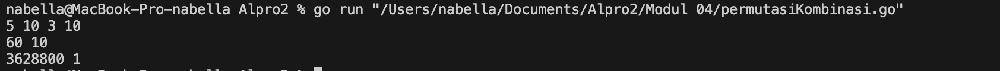
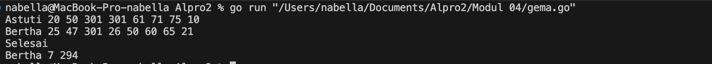
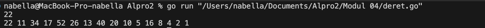

# <h1 align="center">Laporan Praktikum Modul 04<br> Prosedur</h1>
<p align="center">Nabella Rahmatus Sania - 103112430002</p>

## Dasar Teori

Prosedur dapat dianggap sebagai potongan beberapa instruksi program menjadi suatu instruksi baru yang dibuat untuk mengurangi kerumitan dari kode program yang kompleks pada suatu program yang besar. Prosedur akan menghasilkan suatu akibat atau efek langsung pada program ketika dipanggil pada program utama.
## Unguided

### Soal 1

Minggu ini, mahasiswa Fakultas Informatika mendapatkan tugas dari mata kuliah matematika diskrit untuk mempelajari kombinasi dan permutasi. Jonas salah seorang mahasiswa, iseng untuk mengimplementasikannya ke dalam suatu program. Oleh karena itu bersediakah kalian membantu Jonas? (tidak tentunya ya :p)
Masukan terdiri dari empat buah bilangan asli 𝑎, 𝑏, 𝑐, dan 𝑑 yang dipisahkan oleh spasi, dengan syarat 𝑎 ≥ 𝑐 dan 𝑏 ≥ 𝑑.
Keluaran terdiri dari dua baris. Baris pertama adalah hasil permutasi dan kombinasi 𝒂 terhadap 𝑐, sedangkan baris kedua adalah hasil permutasi dan kombinasi 𝑏 terhadap 𝑑.
Catatan: permutasi (P) dan kombinasi (C) dari 𝑛 terhadap 𝑟 (𝑛 ≥ 𝑟) dapat dihitung dengan menggunakan persamaan berikut!
𝑃 (𝑛, 𝑟) = 𝑛! / (𝑛−𝑟)! , sedangkan 𝐶 (𝑛, 𝑟) = 𝑛! / 𝑟!(𝑛−𝑟)!

```go
package main

  

import (

"fmt"

)

  

func faktorial(n int) int {

if n == 0 || n == 1 {

return 1

}

return n * faktorial(n-1)

}

  

func permutasi(n, r int) int {

if r > n {

return 0

}

return faktorial(n) / faktorial(n-r)

}

  

func kombinasi(n, r int) int {

if r > n {

return 0

}

return faktorial(n) / (faktorial(r) * faktorial(n-r))

}

  

func main() {

var a, b, c, d int

fmt.Scan(&a, &b, &c, &d)

  

pA := permutasi(a, c)

kA := kombinasi(a, c)

pB := permutasi(b, d)

kB := kombinasi(b, d)

  

fmt.Println(pA, kA)

fmt.Println(pB, kB)

}
```

> Output
> 

Program ini bertujuan untuk menghitung faktorial, permutasi, dan kombinasi menggunakan bahasa Go. Faktorial adalah hasil perkalian semua bilangan dari 1 hingga n, yang digunakan dalam perhitungan permutasi dan kombinasi. Permutasi menghitung jumlah cara memilih r objek dari n objek dengan memperhatikan urutan, sedangkan kombinasi menghitung jumlah cara memilih r objek dari n objek tanpa memperhatikan urutan. Program ini menerima empat input, yaitu a, b, c, dan d, lalu menghitung permutasi dan kombinasi untuk (a, c) serta (b, d). Hasil perhitungan ditampilkan dalam dua baris, di mana baris pertama berisi permutasi dan kombinasi dari (a, c), sedangkan baris kedua berisi permutasi dan kombinasi dari (b, d). 
### Soal 2

Kompetisi pemrograman tingkat nasional berlangsung ketat. Setiap peserta diberikan 8 soal yang harus dapat diselesaikan dalam waktu 5 jam saja. Peserta yang berhasil menyelesaikan soal paling banyak dalam waktu paling singkat adalah pemenangnya.
Buat program gema yang mencari pemenang dari daftar peserta yang diberikan. Program harus dibuat modular, yaitu dengan membuat prosedur hitungSkor yang mengembalikan total soal dan total skor yang dikerjakan oleh seorang peserta, melalui parameter formal. Pembacaan nama peserta dilakukan di program utama, sedangkan waktu pengerjaan dibaca di dalam prosedur.

```go
package main

  

import (

"fmt"

"math"

)

  

const MAX_TIME = 301

  

func hitungSkor(times []int) (int, int) {

soal := 0

totalWaktu := 0

for _, t := range times {

if t < MAX_TIME {

soal++

totalWaktu += t

}

}

  

return soal, totalWaktu

}

  

func main() {

var nama, pemenang string

var waktu [8]int

var soal, skor int

var maxSoal, minWaktu int = 0, math.MaxInt32

  

for {

fmt.Scan(&nama)

if nama == "Selesai" {

break

}

  

for i := 0; i < 8; i++ {

fmt.Scan(&waktu[i])

}

  

soal, skor = hitungSkor(waktu[:])

  

if soal > maxSoal || (soal == maxSoal && skor < minWaktu) {

maxSoal = soal

minWaktu = skor

pemenang = nama

}

}

  

if pemenang != "" {

fmt.Println(pemenang, maxSoal, minWaktu)

} else {

fmt.Println("Tidak ada peserta.")

}

  

}
```

> Output
> 

Program ini menentukan pemenang kompetisi berdasarkan jumlah soal yang diselesaikan dan total waktu pengerjaan. Soal dengan waktu ≥301 detik tidak dihitung. Fungsi hitungSkor() menghitung jumlah soal dan total waktu yang valid. Dalam main(), program membaca nama peserta dan waktu pengerjaan 8 soal hingga ditemukan input "Selesai". Pemenang adalah peserta dengan soal terbanyak, atau jika sama, peserta dengan total waktu paling sedikit. Hasil akhirnya mencetak nama pemenang, jumlah soal, dan total waktu, atau "Tidak ada peserta." jika tidak ada yang memenuhi kriteria.
### Soal 3

Skiena dan Revilla dalam Programming Challenges mendefinisikan sebuah deret bilangan. Deret dimulai dengan sebuah bilangan bulat n. Jika bilangan n saat itu genap, maka suku berikutnya adalah 1⁄2n, tetapi jika ganjil maka suku berikutnya bernilai 3n+1. Rumus yang sama digunakan terus menerus untuk mencari suku berikutnya. Deret berakhir ketika suku terakhir

```go
package main

  

import (

"fmt"

)

  

func cetakDeret(n int) {

for n != 1 {

fmt.Print(n, " ")

if n%2 == 0 {

n /= 2

} else {

n = 3*n + 1

}

}

fmt.Println(1)

}

  

func main() {

var n int

fmt.Scan(&n)

  

if n > 0 && n < 1000000 {

cetakDeret(n)

} else {

fmt.Println("Bilangan harus lebih besar dari 0 dan kurang dari 1.000.000")

}

}
```

> Output
> 

Program ini mencetak deret angka berdasarkan aturan tertentu. Dimulai dari bilangan n, jika n genap, maka dibagi 2 (n /= 2), sedangkan jika n ganjil, maka dihitung dengan rumus 3n + 1. Proses ini terus berlanjut hingga mencapai angka 1.
Di dalam main(), program meminta input bilangan n, lalu mengecek apakah n berada dalam rentang 1 hingga 999.999. Jika valid, fungsi cetakDeret(n) dipanggil untuk mencetak deretnya. Jika tidak, program akan menampilkan pesan bahwa bilangan harus berada dalam rentang yang diperbolehkan.