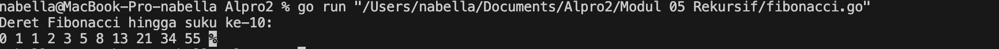
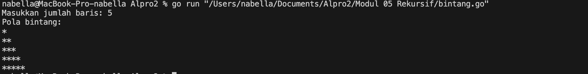
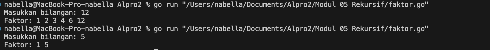
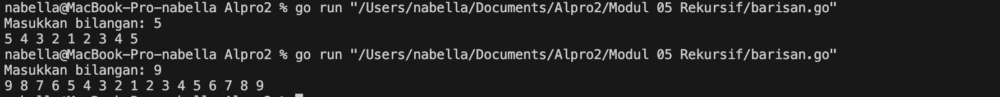
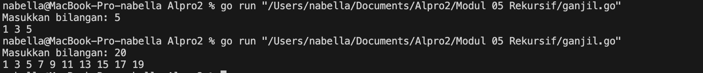
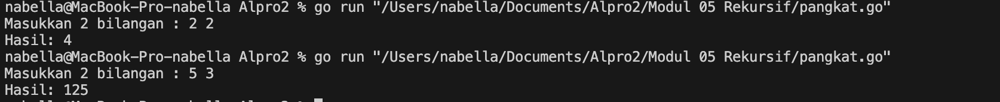

# <h1 align="center">Laporan Praktikum Modul 05<br> Rekursif</h1>
<p align="center">Nabella Rahmatus Sania - 103112430002</p>

## Dasar Teori

Fungsi rekursif di Golang adalah fungsi yang memanggil dirinya sendiri untuk menyelesaikan suatu masalah dengan memecahnya menjadi sub-masalah yang lebih kecil. Rekursi terdiri dari dua bagian utama, yaitu base case (kondisi berhenti) yang memastikan rekursi tidak berjalan tanpa henti, dan recursive case (panggilan rekursif) yang memanggil fungsi itu sendiri dengan input yang lebih kecil hingga mencapai base case.
## Unguided

### Soal 1

Deret fibonacci adalah sebuah deret dengan nilai suku ke-0 dan ke-1 adalah 0 dan 1, dan nilai suku ke-n selanjutnya adalah hasil penjumlahan dua suku sebelumnya. Secara umum dapat diformulasikan 𝑆𝑛 = 𝑆𝑛−1 + 𝑆𝑛−2 . Berikut ini adalah contoh nilai deret fibonacci hingga suku ke-10. Buatlah program yang mengimplementasikan fungsi rekursif pada deret fibonacci tersebut.

```go
package main

  

import (

"fmt"

)

  

func fibonacci(n int) int {

if n == 0 {

return 0

} else if n == 1 {

return 1

} else {

return fibonacci(n-1) + fibonacci(n-2)

}

}

  

func main() {

n := 10

fmt.Println("Deret Fibonacci hingga suku ke-10:")

for i := 0; i <= n; i++ {

fmt.Printf("%d ", fibonacci(i))

}

}
```

> Output
> 

Kode di atas adalah program untuk menghitung dan menampilkan deret Fibonacci hingga suku ke-10 menggunakan rekursi. Fungsi fibonacci(n) bekerja dengan memeriksa nilai n, jika n adalah 0 atau 1, maka langsung mengembalikan 0 atau 1. Jika lebih dari 1, fungsi akan memanggil dirinya sendiri untuk menghitung (n-1) + (n-2). Dalam main(), program menggunakan perulangan for untuk mencetak hasil Fibonacci dari 0 hingga 10.
### Soal 2

Buatlah sebuah program yang digunakan untuk menampilkan pola bintang berikut ini dengan menggunakan fungsi rekursif. N adalah masukan dari user.

```go
package main

  

import "fmt"

  

func printLine(count int) {

if count == 0 {

return

}

fmt.Print("*")

printLine(count - 1)

}

  

func printPattern(rows int, current int) {

if current > rows {

return

}

printLine(current)

fmt.Println()

printPattern(rows, current+1)

}

  

func main() {

var n int

fmt.Print("Masukkan jumlah baris: ")

fmt.Scan(&n)

fmt.Println("Pola bintang:")

printPattern(n, 1)

}
```

> Output
> 

Program ini mencetak pola segitiga bintang menggunakan rekursif.
1. printLine(count int) berfungsi mencetak bintang sebanyak count secara rekursif. Jika count sudah 0, fungsi berhenti.
2. printPattern(rows int, current int) digunakan untuk mencetak baris-baris bintang. Dimulai dari 1 bintang hingga rows. Setelah mencetak satu baris, fungsi memanggil dirinya sendiri untuk baris berikutnya.
3. main() meminta pengguna memasukkan jumlah baris, lalu memanggil printPattern() untuk mencetak pola.
### Soal 3

Buatlah program yang mengimplementasikan rekursif untuk menampilkan faktor bilangan dari suatu N, atau bilangan yang apa saja yang habis membagi N.

```go
package main

  

import "fmt"

  

func faktor(n, i int) {

if i > n {

return

}

if n%i == 0 {

fmt.Print(i, " ")

}

faktor(n, i+1)

}

  

func main() {

var bilangan int

fmt.Print("Masukkan bilangan: ")

fmt.Scan(&bilangan)

fmt.Print("Faktor: ")

faktor(bilangan, 1)

fmt.Println()

}
```

> Output
> 

Program ini mencari dan mencetak faktor dari sebuah bilangan menggunakan rekursif.
1. faktor(n, i int) adalah fungsi rekursif yang memeriksa apakah i adalah faktor dari n. Jika n % i == 0, maka i dicetak. Fungsi terus berjalan dengan i+1 hingga i lebih besar dari n.    
2. main() meminta pengguna memasukkan bilangan, lalu memanggil faktor(n, 1) untuk mencari faktor dari angka tersebut.

### Soal 4

Buatlah program yang mengimplementasikan rekursif untuk menampilkan barisan bilangan tertentu.

```go
package main

  

import "fmt"

  

func turun(n int) {

if n == 0 {

return

}

fmt.Print(n, " ")

turun(n - 1)

}

  

func naik(i, n int) {

if i > n {

return

}

fmt.Print(i, " ")

naik(i+1, n)

}

  

func main() {

var n int

fmt.Print("Masukkan bilangan: ")

fmt.Scan(&n)

turun(n)

naik(2, n)

fmt.Println()

}
```

> Output
> 

Program ini mencetak bilangan secara menurun dari n ke 1 menggunakan fungsi rekursif turun(n), lalu mencetak bilangan naik dari 2 ke n dengan fungsi naik(i, n). Fungsi turun(n) mencetak n lalu memanggil dirinya sendiri dengan n-1 hingga mencapai 0. Sebaliknya, naik(i, n) mencetak i lalu memanggil dirinya sendiri dengan i+1 hingga mencapai n. Dalam main(), pengguna memasukkan nilai n, lalu program memanggil kedua fungsi tersebut untuk mencetak pola angka.

### Soal 5

Buatlah program yang mengimplementasikan rekursif untuk menampilkan barisan bilangan ganjil.

```go
package main

  

import "fmt"

  

func cetakGanjil(i, n int) {

if i > n {

return

}

fmt.Print(i, " ")

cetakGanjil(i+2, n)

}

  

func main() {

var n int

fmt.Print("Masukkan bilangan: ")

fmt.Scan(&n)

cetakGanjil(1, n)

fmt.Println()

}
```

> Output
> 

Program ini mencetak bilangan ganjil dari 1 hingga n menggunakan rekursif. Fungsi cetakGanjil(i, n) akan mencetak i lalu memanggil dirinya sendiri dengan i+2, sehingga hanya mencetak bilangan ganjil. Jika i sudah lebih besar dari n, fungsi berhenti. Dalam main(), pengguna memasukkan nilai n, lalu program memanggil cetakGanjil(1, n) untuk mencetak bilangan ganjil dari 1 hingga n.

### Soal 6

Buatlah program yang mengimplementasikan rekursif untuk mencari hasil pangkat dari dua buah bilangan.

```go
package main

  

import "fmt"

  

func pangkat(x, y int) int {

if y == 0 {

return 1

}

return x * pangkat(x, y-1)

}

  

func main() {

var x, y int

fmt.Print("Masukkan 2 bilangan : ")

fmt.Scan(&x, &y)

hasil := pangkat(x, y)

fmt.Println("Hasil:", hasil)

}

```

> Output
> 

Program ini menghitung hasil perpangkatan x^y menggunakan rekursif. Fungsi pangkat(x, y) bekerja dengan memeriksa jika y == 0, maka hasilnya 1 (karena bilangan apa pun pangkat 0 adalah 1). Jika tidak, fungsi akan mengalikan x dengan hasil pangkat(x, y-1), sehingga prosesnya terus berjalan hingga y mencapai 0. Dalam main(), pengguna memasukkan dua angka, lalu program menghitung dan mencetak hasilnya.