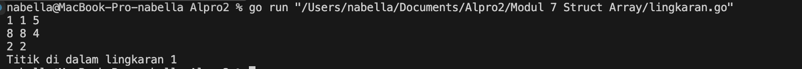
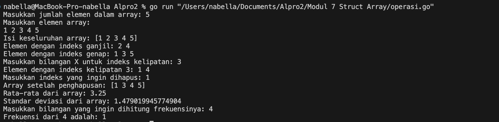
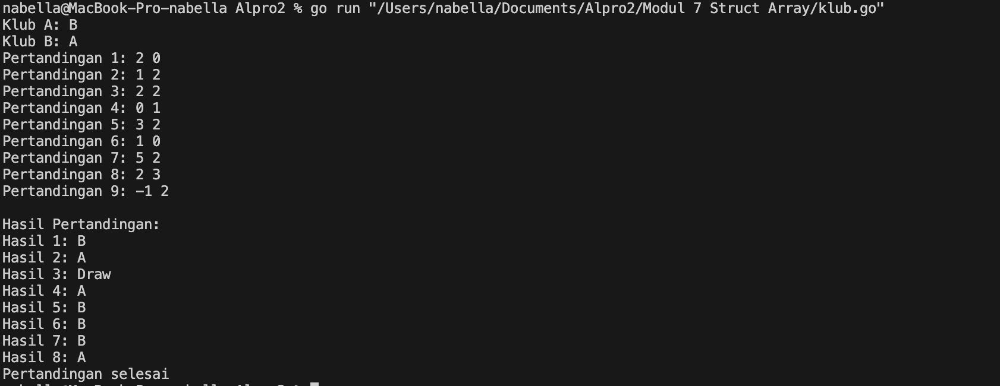
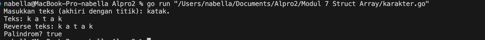

# <h1 align="center">Laporan Praktikum Modul 07<br> Struct Array</h1>
<p align="center">Nabella Rahmatus Sania - 103112430002</p>

## Dasar Teori

Dalam Golang, Struct adalah struktur data yang digunakan untuk mengelompokkan beberapa atribut atau variabel dengan tipe data yang berbeda dalam satu entitas. Sedangkan Array adalah kumpulan elemen dengan tipe data yang sama yang disimpan dalam satu variabel dengan ukuran tetap. Setiap elemen dalam array memiliki indeks yang digunakan untuk mengakses atau mengubah nilainya. Dalam Golang, ukuran array harus ditentukan saat deklarasi dan tidak bisa diubah setelahnya. Untuk struktur data yang lebih fleksibel, digunakan slice, yang merupakan versi dinamis dari array.
## Unguided

### Soal 1

Suatu lingkaran didefinisikan dengan koordinat titik pusat (𝑐𝑥, 𝑐𝑦) dengan radius 𝑟. Apabila diberikan dua buah lingkaran, maka tentukan posisi sebuah titik sembarang (𝑥,𝑦) berdasarkan dua lingkaran tersebut. Gunakan tipe bentukan titik untuk menyimpan koordinat, dan tipe bentukan lingkaran untuk menyimpan titik pusat lingkaran dan radiusnya.

```go
package main

  

import (

"fmt"

"math"

)

  

type Titik struct {

x, y int

}

  

type Lingkaran struct {

pusat Titik

radius int

}

  

func jarak(a, b Titik) float64 {

return math.Sqrt(math.Pow(float64(a.x-b.x), 2) + math.Pow(float64(a.y-b.y), 2))

}

  

func diDalam(l Lingkaran, t Titik) bool {

return jarak(l.pusat, t) <= float64(l.radius)

}

  

func main() {

var l1, l2 Lingkaran

var t Titik

  

fmt.Scan(&l1.pusat.x, &l1.pusat.y, &l1.radius)

fmt.Scan(&l2.pusat.x, &l2.pusat.y, &l2.radius)

fmt.Scan(&t.x, &t.y)

  

dalam1 := diDalam(l1, t)

dalam2 := diDalam(l2, t)

  

if dalam1 && dalam2 {

fmt.Println("Titik di dalam lingkaran 1 dan 2")

} else if dalam1 {

fmt.Println("Titik di dalam lingkaran 1")

} else if dalam2 {

fmt.Println("Titik di dalam lingkaran 2")

} else {

fmt.Println("Titik di luar lingkaran 1 dan 2")

}

}
```

> Output
> 

Program ini mengecek apakah suatu titik berada di dalam satu atau dua lingkaran yang diberikan. Pertama, program menerima input koordinat pusat dan jari-jari dua lingkaran, serta koordinat titik yang akan diperiksa. Program menghitung jarak antara titik dan pusat lingkaran menggunakan rumus jarak Euclidean. Jika jarak ini lebih kecil atau sama dengan jari-jari lingkaran, maka titik dianggap berada di dalam lingkaran tersebut. Berdasarkan hasil perhitungan, program menampilkan apakah titik berada di dalam salah satu, kedua, atau di luar kedua lingkaran.
### Soal 2

Sebuah array digunakan untuk menampung sekumpulan bilangan bulat. Buatlah program yang digunakan untuk mengisi array tersebut sebanyak N elemen nilai. Asumsikan array memiliki kapasitas penyimpanan data sejumlah elemen tertentu. Program dapat menampilkan beberapa informasi berikut:

1. Menampilkan keseluruhan isi dari array.
2. Menampilkan elemen-elemen array dengan indeks ganjil saja.
3. Menampilkan elemen-elemen array dengan indeks genap saja (asumsi indek ke-0 adalah genap).
4. Menampilkan elemen-elemen array dengan indeks kelipatan bilangan x. x bisa diperoleh dari masukan pengguna.
5. Menghapus elemen array pada indeks tertentu, asumsi indeks yang hapus selalu valid. Tampilkan keseluruhan isi dari arraynya, pastikan data yang dihapus tidak tampil
6. Menampilkan rata-rata dari bilangan yang ada di dalam array.
7. Menampilkan standar deviasi atau simpangan baku dari bilangan yang ada di dalam array tersebut.
8. Menampilkan frekuensi dari suatu bilangan tertentu di dalam array yang telah diisi tersebut.

```go
package main

  

import (

"fmt"

"math"

)

  

func main() {

var N int

fmt.Print("Masukkan jumlah elemen dalam array: ")

fmt.Scan(&N)

  

arr := make([]int, N)

fmt.Println("Masukkan elemen array:")

for i := 0; i < N; i++ {

fmt.Scan(&arr[i])

}

  

fmt.Println("Isi keseluruhan array:", arr)

  

fmt.Print("Elemen dengan indeks ganjil: ")

for i := 1; i < N; i += 2 {

fmt.Print(arr[i], " ")

}

fmt.Println()

  

fmt.Print("Elemen dengan indeks genap: ")

for i := 0; i < N; i += 2 {

fmt.Print(arr[i], " ")

}

fmt.Println()

  

var x int

fmt.Print("Masukkan bilangan X untuk indeks kelipatan: ")

fmt.Scan(&x)

fmt.Print("Elemen dengan indeks kelipatan ", x, ": ")

for i := 0; i < N; i++ {

if i%x == 0 {

fmt.Print(arr[i], " ")

}

}

fmt.Println()

  

var delIndex int

fmt.Print("Masukkan indeks yang ingin dihapus: ")

fmt.Scan(&delIndex)

if delIndex >= 0 && delIndex < N {

arr = append(arr[:delIndex], arr[delIndex+1:]...)

fmt.Println("Array setelah penghapusan:", arr)

} else {

fmt.Println("Indeks tidak valid")

}

  

sum := 0

for _, num := range arr {

sum += num

}

average := float64(sum) / float64(len(arr))

fmt.Println("Rata-rata dari array:", average)

  

var variance float64

for _, num := range arr {

variance += math.Pow(float64(num)-average, 2)

}

stdDev := math.Sqrt(variance / float64(len(arr)))

fmt.Println("Standar deviasi dari array:", stdDev)

  

var target int

fmt.Print("Masukkan bilangan yang ingin dihitung frekuensinya: ")

fmt.Scan(&target)

count := 0

for _, num := range arr {

if num == target {

count++

}

}

fmt.Println("Frekuensi dari", target, "adalah:", count)

}
```

> Output
> 

Program ini memungkinkan pengguna untuk melakukan berbagai operasi pada array, seperti menampilkan data berdasarkan indeks tertentu, menghapus elemen, serta melakukan perhitungan statistik seperti rata-rata dan standar deviasi.
1. Menghitung Rata-rata (mean)
	- Menjumlahkan semua elemen dalam array.
	- Membagi jumlah total dengan jumlah elemen untuk mendapatkan rata-rata.
2. Menghitung Standar Deviasi (stdDev)
	- Memanggil `mean(arr)` untuk mendapatkan nilai rata-rata.
	- Menghitung selisih setiap elemen dengan rata-rata, lalu dikuadratkan.
	- Menjumlahkan hasil kuadrat, dibagi jumlah elemen, lalu diakar untuk mendapatkan standar deviasi.
3. Menampilkan Elemen Sesuai Indeks
	- Indeks ganjil = Menampilkan elemen dengan posisi 1, 3, 5, dst.
	- Indeks genap = Menampilkan elemen dengan posisi 0, 2, 4, dst.
	- Indeks kelipatan X = Pengguna memasukkan x, program menampilkan elemen pada indeks kelipatan x.
4. Menghapus Elemen dari Array
	- Pengguna menentukan indeks yang ingin dihapus. 
	- Program menghapus elemen tersebut jika indeks valid, lalu memperbarui array.
5. Perhitungan Statistik
	- Rata-rata dihitung untuk mengetahui nilai tengah dari data.
	- Standar deviasi digunakan untuk mengukur variasi data dalam array.
6. Mengecek Frekuensi Kemunculan Angka
	- Pengguna memasukkan angka yang ingin dicari.
	- Program menghitung dan menampilkan jumlah kemunculan angka tersebut dalam array.

### Soal 3

Sebuah program digunakan untuk menyimpan dan menampilkan nama-nama klub yang memenangkan pertandingan bola pada suatu grup pertandingan. Buatlah program yang digunakan untuk merekap skor pertandingan bola 2 buah klub bola yang berlaga.
Pertama-tama program meminta masukan nama-nama klub yang bertanding, kemudian program meminta masukan skor hasil pertandingan kedua klub tersebut. Yang disimpan dalam array adalah nama-nama klub yang menang saja.
Proses input skor berhenti ketika skor salah satu atau kedua klub tidak valid (negatif). Di akhir program, tampilkan daftar klub yang memenangkan pertandingan.

```go
package main

  

import (

"fmt"

)

  

func main() {

var klubA, klubB string

fmt.Print("Klub A: ")

fmt.Scan(&klubA)

fmt.Print("Klub B: ")

fmt.Scan(&klubB)

  

var skorA, skorB int

var hasil []string

match := 1

  

for {

fmt.Printf("Pertandingan %d: ", match)

fmt.Scan(&skorA, &skorB)

  

if skorA < 0 || skorB < 0 {

break

}

  

if skorA > skorB {

hasil = append(hasil, klubA)

} else if skorB > skorA {

hasil = append(hasil, klubB)

} else {

hasil = append(hasil, "Draw")

}

match++

}

  

fmt.Println("\nHasil Pertandingan:")

for i, h := range hasil {

fmt.Printf("Hasil %d: %s\n", i+1, h)

}

  

fmt.Println("Pertandingan selesai")

}
```

> Output
> 

Program ini mencatat hasil pertandingan antara dua klub berdasarkan skor yang dimasukkan oleh pengguna. Pertandingan terus dicatat hingga pengguna memasukkan skor negatif.
1. Loop for {} (Perulangan Pertandingan)
	- Mengulang proses input skor untuk setiap pertandingan.
	- Berhenti jika pengguna memasukkan skor negatif.
2. if skorA > skorB
	- Menentukan pemenang berdasarkan skor
	- Klub A menang jika skornya lebih tinggi.
	- Klub B menang jika skornya lebih tinggi.
	- "Draw" jika skornya sama.
3. hasil = append(hasil, klubA/klubB/Draw)
	- Menyimpan hasil pertandingan ke dalam array.
4. Menampilkan Hasil Pertandingan
	- Menggunakan for untuk mencetak semua hasil yang telah dicatat.

### Soal 4

Sebuah array digunakan untuk menampung sekumpulan karakter, Anda diminta untuk membuat sebuah subprogram untuk melakukan membalikkan urutan isi array dan memeriksa apakah membentuk palindrom.

```go
package main

  

import (

"fmt"

)

  

const NMAX int = 127

  

type tabel struct {

tab [NMAX]rune

m int

}

  

func isiArray(t *tabel) {

var input string

fmt.Print("Masukkan teks (akhiri dengan titik): ")

fmt.Scanln(&input)

  

t.m = 0

for _, char := range input {

if char == '.' || t.m >= NMAX {

break

}

t.tab[t.m] = char

t.m++

}

}

  

func cetakArray(t tabel) {

fmt.Print("Teks: ")

for i := 0; i < t.m; i++ {

fmt.Print(string(t.tab[i]), " ")

}

fmt.Println()

}

  

func balikanArray(t *tabel) {

for i, j := 0, t.m-1; i < j; i, j = i+1, j-1 {

t.tab[i], t.tab[j] = t.tab[j], t.tab[i]

}

}

  

func palindrom(t tabel) bool {

for i := 0; i < t.m/2; i++ {

if t.tab[i] != t.tab[t.m-1-i] {

return false

}

}

return true

}

  

func main() {

var t tabel

isiArray(&t)

cetakArray(t)

balikanArray(&t)

fmt.Print("Reverse teks: ")

for i := 0; i < t.m; i++ {

fmt.Print(string(t.tab[i]), " ")

}

fmt.Println()

  

if palindrom(t) {

fmt.Println("Palindrom? true")

} else {

fmt.Println("Palindrom? false")

}

}
```

> Output
> 

Program ini membaca teks dari pengguna, kemudian:
	a. Menyimpan teks dalam array.
	b. Menampilkan teks yang dimasukkan.
	c. Membalikkan teks dan menampilkannya.
	d. Mengecek apakah teks tersebut adalah palindrom (teks yang sama jika dibaca terbalik).
	
Program ini terdiri dari beberapa fungsi utama. Fungsi `isiArray` digunakan untuk membaca input teks dari pengguna hingga bertemu tanda titik ('.') atau mencapai batas maksimal penyimpanan, lalu menyimpannya dalam array. Setelah itu, fungsi `cetakArray` menampilkan teks yang telah disimpan dalam bentuk karakter terpisah. Untuk membalik teks, fungsi `balikanArray` menukar posisi karakter dari ujung ke ujung sehingga urutannya menjadi terbalik. Selanjutnya, fungsi `palindrom` mengecek apakah teks yang dimasukkan sama jika dibaca dari depan maupun belakang dengan membandingkan pasangan karakter dari kedua ujung. Terakhir, dalam fungsi `main`, semua fungsi tersebut dipanggil secara berurutan untuk membaca, mencetak, membalikkan teks, dan mengecek apakah teks tersebut adalah palindrom, lalu hasilnya ditampilkan ke layar.