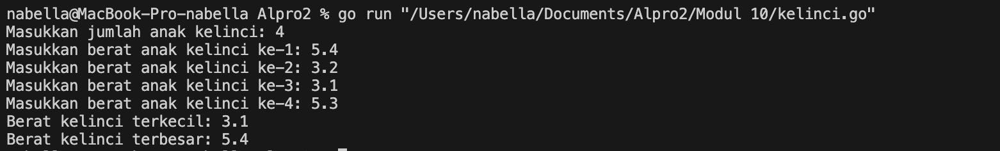
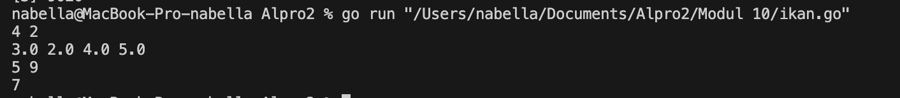
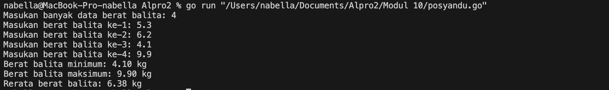

# <h1 align="center">Laporan Praktikum Modul 10<br> Pencarian Nilai Ekstrim pada Himpunan Data</h1>
<p align="center">Nabella Rahmatus Sania - 103112430002</p>

## Dasar Teori

Pencarian nilai ekstrem pada himpunan data dalam bahasa Go adalah proses untuk menemukan nilai terkecil (minimum) dan nilai terbesar (maksimum) dari sekumpulan data yang disimpan dalam array atau slice. Proses pencarian dilakukan dengan cara membandingkan setiap elemen dalam array secara berurutan. Pertama, sebuah nilai awal (biasanya elemen pertama dalam array) diasumsikan sebagai nilai minimum dan maksimum. Kemudian, dilakukan perulangan untuk membandingkan elemen-elemen berikutnya. Jika ditemukan nilai yang lebih kecil dari nilai minimum sementara, maka nilai tersebut menjadi nilai minimum yang baru. Sebaliknya, jika ditemukan nilai yang lebih besar dari nilai maksimum sementara, maka nilai tersebut menjadi nilai maksimum yang baru.
## Unguided

### Soal 1

Sebuah program digunakan untuk mendata berat anak kelinci yang akan dijual ke pasar. Program ini menggunakan array dengan kapasitas 1000 untuk menampung data berat anak kelinci yang akan dijual.
>Masukan terdiri dari sekumpulan bilangan, yang mana bilangan pertama adalah bilangan bulat N yang menyatakan banyaknya anak kelinci yang akan ditimbang beratnya. Selanjutnya N bilangan riil berikutnya adalah berat dari anak kelinci yang akan dijual.
>Keluaran terdiri dari dua buah bilangan riil yang menyatakan berat kelinci terkecil dan terbesar.

```go
package main

  

import "fmt"

  

func main() {

var N int

fmt.Print("Masukkan jumlah anak kelinci: ")

fmt.Scan(&N)

  

if N <= 0 || N > 1000 {

fmt.Println("Jumlah anak kelinci harus antara 1 sampai 1000.")

return

}

  

var berat [1000]float64

  

for i := 0; i < N; i++ {

fmt.Print("Masukkan berat anak kelinci ke-", i+1, ": ")

fmt.Scan(&berat[i])

}

  

terkecil := berat[0]

terbesar := berat[0]

  

for i := 1; i < N; i++ {

if berat[i] < terkecil {

terkecil = berat[i]

}

if berat[i] > terbesar {

terbesar = berat[i]

}

}

  

fmt.Println("Berat kelinci terkecil:", terkecil)

fmt.Println("Berat kelinci terbesar:", terbesar)

}
```

> Output
> 

Program ini digunakan untuk mencatat dan menganalisis data berat anak kelinci yang akan dijual ke pasar. Pertama, pengguna diminta untuk memasukkan jumlah anak kelinci yang akan ditimbang. Jumlah ini harus berada dalam rentang 1 sampai 1000. Setelah itu, pengguna diminta memasukkan berat dari setiap anak kelinci satu per satu. Data berat tersebut disimpan dalam sebuah array.
Setelah semua data dimasukkan, program akan mencari berat kelinci yang paling ringan dan paling berat dengan membandingkan setiap nilai dalam array. Awalnya, berat pertama dianggap sebagai nilai minimum dan maksimum sementara. Kemudian, program memeriksa sisa data untuk menemukan nilai yang lebih kecil atau lebih besar. Terakhir, program menampilkan berat kelinci terkecil dan terbesar berdasarkan data yang telah dimasukkan.
### Soal 2

Sebuah program digunakan untuk menentukan tarif ikan yang akan dijual ke pasar. Program ini menggunakan array dengan kapasitas 1000 untuk menampung data berat ikan yang akan dijual.
>Masukan terdiri dari dua baris, yang mana baris pertama terdiri dari dua bilangan bulat x dan y. Bilangan x menyatakan banyaknya ikan yang akan dijual, sedangkan y adalah banyaknya ikan yang akan dimasukan ke dalam wadah. Baris kedua terdiri dari sejumlah x bilangan riil yang menyatakan banyaknya ikan yang akan dijual.
>Keluaran terdiri dari dua baris. Baris pertama adalah kumpulan bilangan riil yang menyatakan total berat ikan di setiap wadah (jumlah wadah tergantung pada nilai x dan y, urutan ikan yang dimasukan ke dalam wadah sesuai urutan pada masukan baris ke-2). Baris kedua adalah sebuah bilangan riil yang menyatakan berat rata-rata ikan di setiap wadah.

```go
package main

  

import "fmt"

  

func main() {

var x, y int

var berat [1000]float64

  

fmt.Scan(&x, &y)

  

for i := 0; i < x; i++ {

fmt.Scan(&berat[i])

}

  

var total float64

var jumlahWadah int

for i := 0; i < x; i++ {

total += berat[i]

if (i+1)%y == 0 || i == x-1 {

fmt.Print(total, " ")

jumlahWadah++

total = 0

}

}

fmt.Println()

  

var totalBerat float64

for i := 0; i < x; i++ {

totalBerat += berat[i]

}

rata := totalBerat / float64(jumlahWadah)

fmt.Println(rata)

}
```

> Output
> 

Program ini dibuat untuk mencatat dan menghitung total serta rata-rata berat ikan yang akan dijual ke pasar dengan cara mengelompokkannya ke dalam beberapa wadah. Awalnya, pengguna diminta memasukkan dua nilai, yaitu jumlah ikan yang akan ditimbang dan jumlah ikan yang boleh dimasukkan ke dalam satu wadah. Selanjutnya, pengguna memasukkan berat masing-masing ikan. Program kemudian membagi ikan ke dalam wadah berdasarkan urutan input, menghitung total berat setiap wadah, dan menampilkannya. Setelah semua ikan dibagi ke dalam wadah, program menghitung rata-rata berat per wadah, lalu menampilkannya sebagai hasil akhir.

### Soal 3

Pos Pelayanan Terpadu (posyandu) sebagai tempat pelayanan kesehatan perlu mencatat data berat balita (dalam kg). Petugas akan memasukkan data tersebut ke dalam array. Dari data yang diperoleh akan dicari berat balita terkecil, terbesar, dan reratanya.

```go
package main

  

import (

"fmt"

)

  

type arrBalita [100]float64

  

func hitungMinMax(data arrBalita, n int, min, max *float64) {

*min = data[0]

*max = data[0]

  

for i := 1; i < n; i++ {

if data[i] < *min {

*min = data[i]

}

if data[i] > *max {

*max = data[i]

}

}

}

  

func rerata(data arrBalita, n int) float64 {

var total float64

for i := 0; i < n; i++ {

total += data[i]

}

return total / float64(n)

}

  

func main() {

var n int

var data arrBalita

  

fmt.Print("Masukan banyak data berat balita: ")

fmt.Scan(&n)

  

for i := 0; i < n; i++ {

fmt.Print("Masukan berat balita ke-", i+1, ": ")

fmt.Scan(&data[i])

}

  

var min, max float64

hitungMinMax(data, n, &min, &max)

rata := rerata(data, n)

  

fmt.Printf("Berat balita minimum: %.2f kg\n", min)

fmt.Printf("Berat balita maksimum: %.2f kg\n", max)

fmt.Printf("Rerata berat balita: %.2f kg\n", rata)

}
```

> Output
> 

Program ini digunakan untuk mencatat berat balita di Posyandu dan menghitung berat terkecil, terbesar, serta rata-rata berat balita. Pengguna memasukkan jumlah balita dan berat masing-masing balita, yang disimpan dalam array. Program kemudian mencari nilai terkecil dan terbesar dari data tersebut serta menghitung rata-rata berat balita. Hasilnya ditampilkan dalam bentuk berat minimum, maksimum, dan rata-rata dengan dua angka di belakang koma.