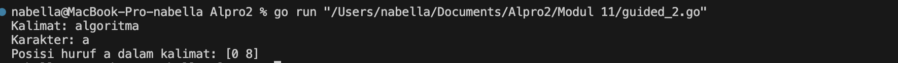

# <h1 align="center">Laporan Praktikum Modul 11<br> Pencarian Nilai Acak pada Himpunan Data</h1>
<p align="center">Nabella Rahmatus Sania - 103112430002</p>

## Dasar Teori

Pencarian nilai acak dalam himpunan data di Golang adalah proses memilih satu atau lebih elemen secara **acak** dari sekumpulan data yang sudah ada. Biasanya, himpunan data ini berbentuk array, slice, atau map. Dalam implementasinya, kita menggunakan fungsi dari package `math/rand` untuk menghasilkan indeks acak, lalu mengambil elemen pada posisi tersebut. Ini berguna misalnya untuk membuat simulasi, memilih sampel data, atau membuat fitur yang membutuhkan randomisasi.

---

## Guided

### Soal 1

```go
package main

import "fmt"

func cariBarang(daftar []string, x string) bool {
    for _, barang := range daftar {
        if barang == x {
            return true
        }
    }
    return false
}

func main() {
    var n int
    fmt.Print("Masukkan jumlah barang: ")
    fmt.Scan(&n)

    daftarBarang := make([]string, n)
    fmt.Println("Masukkan nama-nama barang:")
    for i := 0; i < n; i++ {
        fmt.Scan(&daftarBarang[i])
    }

    var barangDicari string
    fmt.Print("Masukkan nama barang yang dicari: ")
    fmt.Scan(&barangDicari)

    ditemukan := cariBarang(daftarBarang, barangDicari)
    fmt.Println(ditemukan)
}

```

Output
> 

Program ini dibuat untuk mencari apakah sebuah barang terdapat di dalam daftar barang yang dimasukkan oleh pengguna. Program bekerja dengan cara:
1. Meminta jumlah barang yang akan didata.
2. Meminta nama-nama barang sesuai jumlah yang telah dimasukkan.
3. Meminta nama barang yang ingin dicari oleh pengguna.
4. Mengecek apakah barang yang dicari ada di dalam daftar barang.
5. Menampilkan hasil pencarian dalam bentuk true (jika ditemukan) atau false (jika tidak ditemukan).
Program ini menggunakan fungsi cariBarang untuk melakukan pencarian. Fungsi ini bekerja dengan mengecek satu per satu barang dalam daftar, dan akan langsung mengembalikan hasil true jika barang ditemukan, atau false jika tidak ditemukan setelah seluruh daftar diperiksa.
### Soal 2

```go
package main

import "fmt"

func seqSearch(kalimat string, karakter byte) []int {
	var posisi []int
	for i := 0; i < len(kalimat); i++ {
		if kalimat[i] == karakter {
			posisi = append(posisi, i)
		}
	}
	return posisi
}

func main() {
	var kalimat string
	var karakter rune

	kalimat = "algoritma pemrograman"
	karakter = 'a'
	posisi := seqSearch(kalimat, byte(karakter))

	if len(posisi) > 0 {
		fmt.Print("Karakter ditemukan pada indeks: ")
		for i := 0; i < len(posisi); i++ {
			fmt.Print(posisi[i])
			if i != len(posisi)-1 {
				fmt.Print(", ")
			}
		}
	} else {
		fmt.Println("Karakter tidak ditemukan.")
	}
}
```

Output
> 

Program ini bertujuan untuk mencari posisi atau indeks dari semua kemunculan sebuah karakter di dalam sebuah kalimat. Program ini menggunakan metode Sequential Search (pencarian berurutan) untuk mengecek setiap huruf satu per satu.
Alur kerja program:
1. Program menyimpan sebuah kalimat dan sebuah karakter yang ingin dicari di dalam kalimat tersebut.
2. Program menggunakan fungsi seqSearch untuk:
	- Membandingkan setiap karakter dalam kalimat dengan karakter yang dicari.
    - Menyimpan semua indeks (posisi) di mana karakter tersebut ditemukan.
3. Program menampilkan:
    - Jika karakter ditemukan, semua indeks tempat karakter tersebut muncul.
    - Jika karakter tidak ditemukan sama sekali, menampilkan pesan bahwa karakter tidak ditemukan.
Fungsi seqSearch menerima input berupa kalimat dan karakter, lalu mengembalikan daftar (slice) berisi indeks-indeks kemunculan karakter tersebut.
### Soal 3

```go
package main

import "fmt"

type Mahasiswa struct {
	NIM  string
	Nama string
}

func binarySearch(mahasiswa []Mahasiswa, target string) int {
	left := 0
	right := len(mahasiswa) - 1

	for left <= right {
		mid := left + (right-left)/2
		if mahasiswa[mid].NIM == target {
			return mid
		}

		if mahasiswa[mid].NIM > target {
			right = mid - 1
		} else {
			left = mid + 1
		}
	}
	return -1
}

func main() {
	mahasiswa := []Mahasiswa{
		{Nama: "Bella", NIM: "0002"},
		{Nama: "Syahla", NIM: "0023"},
		{Nama: "Inay", NIM: "0045"},
		{Nama: "Chilya", NIM: "0087"},
	}

	x := "0023" 

	index := binarySearch(mahasiswa, x)

	if index != -1 {
		fmt.Println("Indeks Mahasiswa ditemukan: ",index)
	} else {
		fmt.Println("NIM tidak ditemukan.")
	}
}

```

Output
> 

Program ini digunakan untuk mencari mahasiswa berdasarkan NIM dengan cara binary search.  
Data mahasiswa disimpan dalam daftar yang sudah urut berdasarkan NIM.
Cara kerjanya: 
1. Program mencari NIM dengan membagi data menjadi dua terus-menerus.
2. Kalau NIM ditemukan, program menampilkan **posisi (indeks)** mahasiswa tersebut.
3. Kalau tidak ditemukan, program memberi tahu bahwa NIM tidak ada.
Binary search membuat pencarian jadi **lebih cepat** dibandingkan mencari satu per satu.

---
## Unguided

### Soal 1

Pada pemilihan ketua RT yang baru saja berlangsung, terdapat 20 calon ketua yang bertanding memperebutkan suara warga. Perhitungan suara dapat segera dilakukan karena warga cukup mengisi formulir dengan nomor dari calon ketua RT yang dipilihnya. Seperti biasa, selalu ada pengisian yang tidak tepat atau dengan nomor pilihan di luar yang tersedia, sehingga data juga harus divalidasi. Tugas Anda untuk membuat program mencari siapa yang memenangkan pemilihan ketua RT. Buatlah program pilkart yang akan membaca, memvalidasi, dan menghitung suara yang diberikan dalam pemilihan ketua RT tersebut.
>**Masukan** hanya satu baris data saja, berisi bilangan bulat valid yang kadang tersisipi dengan data tidak valid. Data valid adalah integer dengan nilai di antara 1 s.d. 20 (inklusif). Data berakhir jika ditemukan sebuah bilangan dengan nilai 0. 
>**Keluaran** dimulai dengan baris berisi jumlah data suara yang terbaca, diikuti baris yang berisi berapa banyak suara yang valid. Kemudian sejumlah baris yang mencetak data para calon apa saja yang mendapatkan suara.

```go
package main

import (
	"fmt"
)

func main() {
	var suaraMasuk []int
	var angka int

	fmt.Println("Masukkan suara (akhiri dengan 0):")
	for {
		fmt.Scan(&angka)
		if angka == 0 {
			break
		}
		suaraMasuk = append(suaraMasuk, angka)
	}

	totalSuara := len(suaraMasuk)
	suaraSah := 0
	hitungSuara := make(map[int]int)

	for _, suara := range suaraMasuk {
		if suara >= 1 && suara <= 20 {
			suaraSah++
			hitungSuara[suara]++
		}
	}

	fmt.Println("Suara masuk:", totalSuara)
	fmt.Println("Suara sah:", suaraSah)

	for calon, jumlah := range hitungSuara {
		fmt.Printf("%d: %d\n", calon, jumlah)
	}
}
```

> Output
> 

Program ini berfungsi untuk mencatat hasil suara dalam sebuah pemilihan. Caranya, pengguna akan memasukkan angka-angka yang mewakili suara untuk calon tertentu. Input dilakukan terus-menerus hingga pengguna mengetik angka 0 untuk mengakhiri.
Setelah semua suara dimasukkan: 
1. Program menghitung jumlah seluruh suara yang masuk.
2. Program juga menghitung jumlah suara sah, yaitu suara untuk calon nomor 1 hingga 20.
3. Kemudian, program menghitung berapa banyak suara yang diterima oleh masing-masing calon.
Akhirnya, program akan menampilkan:
- Total suara masuk.
- Total suara sah.
- Dan daftar setiap calon beserta jumlah suaranya.
### Soal 2

Berdasarkan program sebelumnya, buat program pilkart yang mencari siapa pemenang pemilihan ketua RT. Sekaligus juga ditentukan bahwa wakil ketua RT adalah calon yang mendapatkan suara terbanyak kedua. Jika beberapa calon mendapatkan suara terbanyak yang sama, ketua terpilih adalah dengan nomor peserta yang paling kecil dan wakilnya dengan nomor peserta terkecil berikutnya.
>**Masukan** hanya satu baris data saja, berisi bilangan bulat valid yang kadang tersisipi dengan data tidak valid. Data valid adalah bilangan bulat dengan nilai di antara 1 s.d. 20 (inklusif). Data berakhir jika ditemukan sebuah bilangan dengan nilai 0. 
>**Keluaran** dimulai dengan baris berisi jumlah data suara yang terbaca, diikuti baris yang berisi berapa banyak suara yang valid. Kemudian tercetak calon nomor berapa saja yang menjadi pasangan ketua RT dan wakil ketua RT yang baru.

```go
package main

import (
	"fmt"
	"sort"
)

func main() {
	var suaraMasuk []int
	var angka int

	fmt.Println("Masukkan suara (akhiri dengan 0):")
	for {
		fmt.Scan(&angka)
		if angka == 0 {
			break
		}
		suaraMasuk = append(suaraMasuk, angka)
	}

	totalSuara := len(suaraMasuk)
	suaraSah := 0
	hitungSuara := make(map[int]int)

	for _, suara := range suaraMasuk {
		if suara >= 1 && suara <= 20 {
			suaraSah++
			hitungSuara[suara]++
		}
	}

	type calon struct {
		nomor int
		suara int
	}

	var daftarCalon []calon
	for nomor, suara := range hitungSuara {
		daftarCalon = append(daftarCalon, calon{nomor, suara})
	}

	sort.Slice(daftarCalon, func(i, j int) bool {
		if daftarCalon[i].suara == daftarCalon[j].suara {
			return daftarCalon[i].nomor < daftarCalon[j].nomor
		}
		return daftarCalon[i].suara > daftarCalon[j].suara
	})

	fmt.Println("Suara masuk:", totalSuara)
	fmt.Println("Suara sah:", suaraSah)

	if len(daftarCalon) > 0 {
		fmt.Println("Ketua RT:", daftarCalon[0].nomor)
	}
	if len(daftarCalon) > 1 {
		fmt.Println("Wakil ketua:", daftarCalon[1].nomor)
	}
}
```

> Output
> 

Program ini berfungsi untuk menghitung hasil pemilihan Ketua dan Wakil Ketua RT.  
Pengguna memasukkan angka yang mewakili suara untuk calon, dan memasukkan angka 0 untuk mengakhiri input.
Program akan:
- Menyimpan semua suara yang masuk.
- Menghitung jumlah total suara dan jumlah suara sah (suara untuk calon nomor 1–20).
- Mencatat jumlah suara yang diperoleh setiap calon dalam sebuah daftar.
- Mengurutkan daftar calon berdasarkan:
    - Suara terbanyak di posisi atas.
    - Jika suara sama, nomor calon terkecil diutamakan.
- Menentukan:
    - Ketua RT adalah calon dengan suara terbanyak.
    - Wakil Ketua RT adalah calon dengan suara terbanyak kedua.
### Soal 3

Diberikan n data integer positif dalam keadaan terurut membesar dan sebuah integer lain k, apakah bilangan k tersebut ada dalam daftar bilangan yang diberikan? Jika ya, berikan indeksnya, jika tidak sebutkan "TIDAK ADA".
>**Masukan** terdiri dari dua baris. Baris pertama berisi dua buah integer positif, yaitu n dan k. n menyatakan banyaknya data, dimana 1 < n <= 1000000. k adalah bilangan yang ingin dicari. Baris kedua berisi n buah data integer positif yang sudah terurut membesar. 
>**Keluaran** terdiri dari satu baris saja, yaitu sebuah bilangan yang menyatakan posisi data yang dicari (k) dalam kumpulan data yang diberikan. Posisi data dihitung dimulai dari angka 0. Atau memberikan keluaran "TIDAK ADA" jika data k tersebut tidak ditemukan dalam kumpulan.

```go
package main

import (
    "fmt"
)

const NMAX = 1000000
var data [NMAX]int

func main() {
    var n, k int

    fmt.Scan(&n, &k)

    isiArray(n)

    pos := posisi(n, k)

    if pos == -1 {
        fmt.Println("TIDAK ADA")
    } else {
        fmt.Println(pos)
    }
}

func isiArray(n int) {
    for i := 0; i < n; i++ {
        fmt.Scan(&data[i])
    }
}

func posisi(n, k int) int {
    left, right := 0, n-1
    for left <= right {
        mid := (left + right) / 2
        if data[mid] == k {
            return mid
        } else if data[mid] < k {
            left = mid + 1
        } else {
            right = mid - 1
        }
    }
    return -1
}
```

> Output
> 

Program ini digunakan untuk mencari posisi sebuah angka dalam sebuah array menggunakan metode binary search.  
Pertama, pengguna memasukkan jumlah data (n) dan angka yang ingin dicari (k).  
Kemudian, pengguna mengisi array sebanyak n angka.
Program mencari posisi angka k di dalam array:
- Jika angka ditemukan, program mencetak posisi (indeks) dari angka tersebut.
- Jika tidak ditemukan, program menampilkan pesan "TIDAK ADA".
Proses pencarian menggunakan metode binary search, yaitu mencari angka dengan membagi array menjadi dua bagian secara berulang, sehingga pencarian menjadi lebih cepat.  
Catatan: array harus terurut agar binary search bekerja dengan benar.