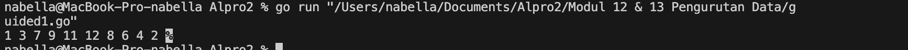
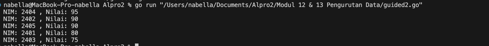
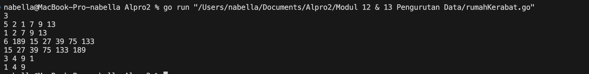
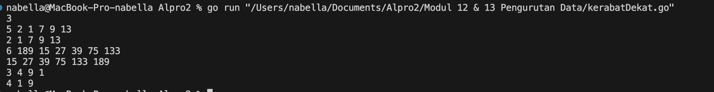
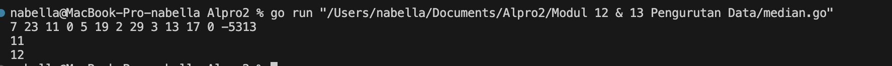
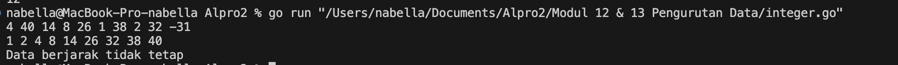
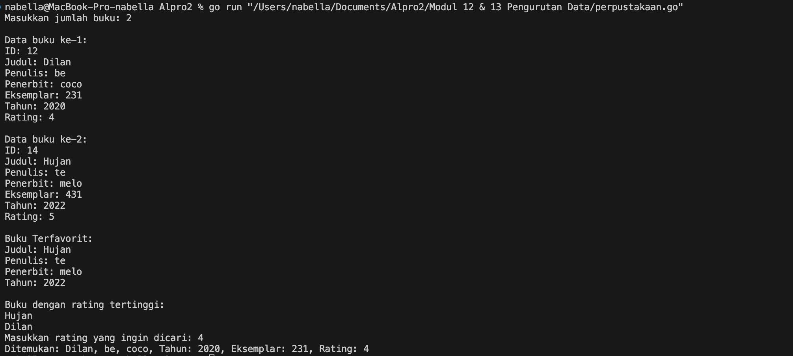

# <h1 align="center">Laporan Praktikum Modul 12 & 13<br> Pengurutan Data</h1>
<p align="center">Nabella Rahmatus Sania - 103112430002</p>

## Dasar Teori

Pengurutan data adalah proses menyusun elemen-elemen dalam suatu struktur data (seperti array atau slice) menurut urutan tertentu, biasanya menaik (ascending) atau menurun (descending). Contohnya adalah Selection sort dan Insertion sort. Selection Sort adalah metode pengurutan dengan cara mencari nilai terkecil (atau terbesar) dari elemen yang belum diurutkan, lalu menukarnya dengan elemen di posisi awal. Insertion Sort bekerja seperti saat kita menyusun kartu bermain di tangan. Setiap elemen diambil satu per satu, lalu disisipkan ke posisi yang sesuai dalam bagian array yang sudah diurutkan.

---

## Guided

### Soal 1
Diberikan `n` bilangan bulat positif. Buat program untuk mengurutkan angka ganjil secara membesar (ascending) dan angka genap secara mengecil (descending), lalu gabungkan hasilnya dengan ganjil duluan.
Gunakan selection sort dalam proses pengurutan.

```go
package main

import "fmt"

func selectionSortAsc(arr []int, panjang int) {
	var temp, i, j, idxMin int
	for i = 0; i < panjang-1; i++ {
		idxMin = i
		for j = i + 1; j < panjang; j++ {
			if arr[j] < arr[idxMin] {
				idxMin = j
			}
		}
		temp = arr[idxMin]
		arr[idxMin] = arr[i]
		arr[i] = temp
	}
}

func selectionSortDesc(arr []int, panjang int) {
	var temp, i, j, idxMax int
	for i = 0; i < panjang-1; i++ {
		idxMax = i
		for j = i + 1; j < panjang; j++ {
			if arr[j] > arr[idxMax] {
				idxMax = j
			}
		}
		temp = arr[idxMax]
		arr[idxMax] = arr[i]
		arr[i] = temp
	}
}

func main() {
	n := 10
	numbers := []int{12, 7, 3, 2, 9, 6, 8, 1, 11, 4}

	var ganjil []int
	var genap []int

	for i := 0; i < n; i++ {
		if numbers[i]%2 == 1 {
			ganjil = append(ganjil, numbers[i])
		} else {
			genap = append(genap, numbers[i])
		}
	}

	selectionSortAsc(ganjil, len(ganjil))
	selectionSortDesc(genap, len(genap))

	for i := 0; i < len(ganjil); i++ {
		fmt.Print(ganjil[i], " ")
	}
	for i := 0; i < len(genap); i++ {
		fmt.Print(genap[i], " ")
	}
}

```

Output
> 

Program ini dibuat untuk memisahkan bilangan ganjil dan genap dari sebuah daftar angka, lalu mengurutkannya dengan cara yang berbeda. Pertama, program menyimpan semua angka ke dalam array, kemudian memeriksa satu per satu apakah angka tersebut ganjil atau genap. Angka ganjil dimasukkan ke dalam array khusus ganjil, dan angka genap ke dalam array genap. Setelah itu, array ganjil diurutkan dari yang terkecil ke yang terbesar (ascending), sedangkan array genap diurutkan dari yang terbesar ke yang terkecil (descending), keduanya menggunakan metode selection sort. Setelah proses pengurutan selesai, hasil dari kedua array tersebut digabungkan dan ditampilkan: dimulai dari angka ganjil yang telah diurutkan naik, lalu dilanjutkan dengan angka genap yang telah diurutkan turun. Dengan cara ini, hasil akhir menampilkan angka-angka ganjil dalam urutan menaik diikuti angka genap dalam urutan menurun.

### Soal 2
Sebuah kelas memiliki sejumlah siswa yang telah mengikuti ujian. Tugas Anda adalah membuat program yang membaca nilai-nilai ujian siswa dengan struct berisikan `nim` dan `nilai`, lalu mengurutkannya dari yang tertinggi ke yang terendah menggunakan insertion sort.

```go
package main

import "fmt"

type Siswa struct {
	NIM   string
	Nilai int
}

func insertionSortDescending(data []Siswa) {
	for i := 1; i < len(data); i++ {
		temp := data[i]
		j := i - 1
		for j >= 0 && data[j].Nilai < temp.Nilai {
			data[j+1] = data[j]
			j--
		}
		data[j+1] = temp
	}
}

func main() {
	siswa := []Siswa{
		{"2401", 80},
		{"2402", 90},
		{"2403", 75},
		{"2404", 95},
		{"2405", 90},
	}

	insertionSortDescending(siswa)

	for _, s := range siswa {
		fmt.Println("NIM:", s.NIM, ", Nilai:", s.Nilai)
	}
	
}
```

Output
> 

Program ini bertujuan untuk mengurutkan data siswa berdasarkan nilai secara menurun (dari yang tertinggi ke terendah) menggunakan algoritma insertion sort. Setiap data siswa disimpan dalam struct Siswa yang memiliki dua atribut, yaitu NIM dan Nilai. Di dalam fungsi main, dibuat slice berisi beberapa data siswa. Fungsi insertionSortDescending akan membandingkan nilai setiap siswa dengan siswa sebelumnya dan menempatkan siswa tersebut di posisi yang sesuai agar urutannya menjadi dari yang tertinggi ke terendah. Setelah proses pengurutan selesai, program mencetak hasilnya dengan menampilkan NIM dan nilai dari masing-masing siswa secara berurutan.

---
## Unguided

## Soal Latihan Selection Sort
### Soal 1
Hercules, preman terkenal seantero ibukota, memiliki kerabat di banyak daerah. Tentunya Hercules sangat suka mengunjungi semua kerabatnya itu. Diberikan masukan nomor rumah dari semua kerabatnya di suatu daerah, buatlah program rumahkerabat yang akan menyusun nomor-nomor rumah kerabatnya secara terurut membesar menggunakan algoritma selection sort.

```go
package main

import "fmt"

func selectionSort(data []int) {
	for i := 0; i < len(data)-1; i++ {
		minIndex := i
		for j := i + 1; j < len(data); j++ {
			if data[j] < data[minIndex] {
				minIndex = j
			}
		}
		data[i], data[minIndex] = data[minIndex], data[i]
	}
}

func main() {
	var n int
	fmt.Scan(&n) 

	for i := 0; i < n; i++ {
		var m int
		fmt.Scan(&m) 

		rumah := make([]int, m)
		for j := 0; j < m; j++ {
			fmt.Scan(&rumah[j]) 
		}
		selectionSort(rumah) 
		for _, nomor := range rumah {
			fmt.Print(nomor, " ")
		}
		fmt.Println()
	}
}
```

> Output
> 

Program ini dibuat untuk mengurutkan beberapa kelompok angka dari yang terkecil ke terbesar. Pertama, pengguna memasukkan jumlah kelompok data. Lalu, untuk tiap kelompok, pengguna memasukkan jumlah dan isi angkanya. Angka-angka tersebut disimpan dalam slice, lalu diurutkan menggunakan fungsi selectionSort, yang bekerja dengan cara mencari angka terkecil dan menukarnya ke depan. Setelah semua angka terurut, hasilnya ditampilkan per baris. Program ini cocok digunakan untuk mengurutkan data seperti nilai, nomor rumah, atau harga barang dalam beberapa kelompok.
### Soal 2
Belakangan diketahui ternyata Hercules itu tidak berani menyeberang jalan, maka selalu diusahakan agar hanya menyeberang jalan sesedikit mungkin, hanya diujung jalan. Karena nomor rumah sisi kiri jalan selalu ganjil dan sisi kanan jalan selalu genap, maka buatlah program kerabat dekat yang akan menampilkan nomor rumah mulai dari nomor yang ganjil lebih dulu terurut membesar dan kemudian menampilkan nomor rumah dengan nomor genap terurut mengecil.

```go
package main

import (
	"fmt"
)

func selectionSortDesc(arr []int) {
	n := len(arr)
	for i := 0; i < n-1; i++ {
		maxIdx := i
		for j := i + 1; j < n; j++ {
			if arr[j] > arr[maxIdx] {
				maxIdx = j
			}
		}
		arr[i], arr[maxIdx] = arr[maxIdx], arr[i]
	}
}

func selectionSortAsc(arr []int) {
	n := len(arr)
	for i := 0; i < n-1; i++ {
		minIdx := i
		for j := i + 1; j < n; j++ {
			if arr[j] < arr[minIdx] {
				minIdx = j
			}
		}
		arr[i], arr[minIdx] = arr[minIdx], arr[i]
	}
}

func main() {
	var n int
	fmt.Scan(&n) 

	for i := 0; i < n; i++ {
		var m int
		fmt.Scan(&m) 

		var genap []int
		var ganjil []int

		for j := 0; j < m; j++ {
			var nomor int
			fmt.Scan(&nomor)
			if nomor%2 == 0 {
				genap = append(genap, nomor)
			} else {
				ganjil = append(ganjil, nomor)
			}
		}

		selectionSortDesc(genap) 
		selectionSortAsc(ganjil) 

		for _, g := range genap {
			fmt.Printf("%d ", g)
		}

		for _, j := range ganjil {
			fmt.Printf("%d ", j)
		}
		fmt.Println()
	}
}
```

> Output
> 

Program ini dibuat untuk memisahkan dan mengurutkan angka. Cara kerjanya sangat sederhana. Pertama, program meminta berapa kelompok angka yang ingin diproses. Setelah itu, untuk setiap kelompok, pengguna memasukkan beberapa angka. Angka-angka ini kemudian dipisahkan menjadi dua bagian: angka genap dan angka ganjil.

Angka genap akan diurutkan dari besar ke kecil, sedangkan angka ganjil akan diurutkan dari kecil ke besar. Setelah proses pengurutan selesai, program menampilkan hasilnya. Angka genap ditampilkan lebih dulu, lalu diikuti oleh angka ganjil, semua dalam satu baris.

Contohnya, jika pengguna memasukkan angka 4, 1, 6, dan 3, maka angka genapnya adalah 4 dan 6, yang akan diurutkan menjadi 6 4. Angka ganjilnya adalah 1 dan 3, yang akan diurutkan menjadi 1 3. Maka hasil akhirnya adalah: 6 4 1 3. Program ini cocok digunakan saat ingin menyusun angka-angka dengan cara yang rapi dan terpisah antara genap dan ganjil.
### Soal 3
Kompetisi pemrograman yang baru saja berlalu diikuti oleh 17 tim dari berbagai perguruan tinggi ternama. Dalam kompetisi tersebut, setiap tim berlomba untuk menyelesaikan sebanyak mungkin problem yang diberikan. Dari 13 problem yang diberikan, ada satu problem yang menarik. Problem tersebut mudah dipahami, hampir semua tim mencoba untuk menyelesaikannya, tetapi hanya 3 tim yang berhasil. Apa sih problemnya? Buatlah program median yang mencetak nilai median terhadap seluruh data yang sudah terbaca, jika data yang dibaca saat itu adalah 0.

```go
package main

import (
	"bufio"
	"fmt"
	"os"
	"sort"
	"strconv"
)

func median(data []int) int {
	sort.Ints(data)
	n := len(data)
	if n == 0 {
		return 0
	}
	if n%2 == 1 {
		return data[n/2]
	}

	return (data[n/2-1] + data[n/2]) / 2
}

func main() {
	scanner := bufio.NewScanner(os.Stdin)
	scanner.Split(bufio.ScanWords)

	var data []int

	for scanner.Scan() {
		word := scanner.Text()
		num, err := strconv.Atoi(word)
		if err != nil {
			continue
		}

		if num == -5313 {
			break
		} else if num == 0 {
			fmt.Println(median(data))
		} else if num > 0 {
			data = append(data, num)
		}
	}
}
```

> Output
> 

Program ini dibuat untuk menghitung median dari sekumpulan angka yang dimasukkan pengguna secara interaktif. Pengguna dapat memasukkan angka satu per satu. Setiap angka positif akan disimpan, dan jika pengguna mengetik **0**, program akan mengurutkan semua angka yang sudah dimasukkan lalu menghitung dan menampilkan mediannya. Jika jumlah angka ganjil, median adalah angka tengah. Jika genap, median adalah rata-rata dua angka tengah. Program juga akan berhenti jika pengguna mengetik -5313. 
## Soal Latihan Insertion Sort
### Soal 1
Buatlah sebuah program yang digunakan untuk membaca data integer seperti contoh yang diberikan di bawah ini, kemudian diurutkan (menggunakan metoda insertion sort), dan memeriksa apakah data yang terurut berjarak sama terhadap data sebelumnya.

```go
package main

import (
	"fmt"
)

func main() {
	var angka int
	var data []int

	for {
		fmt.Scan(&angka)
		if angka < 0 {
			break
		}
		data = append(data, angka)
	}

	for i := 1; i < len(data); i++ {
		kunci := data[i]
		j := i - 1
		for j >= 0 && data[j] > kunci {
			data[j+1] = data[j]
			j--
		}
		data[j+1] = kunci
	}

	for _, v := range data {
		fmt.Print(v, " ")
	}
	fmt.Println()

	if len(data) < 2 {
		fmt.Println("Data berjarak tidak tetap")
		return
	}

	jarak := data[1] - data[0]
	berjarakTetap := true
	for i := 2; i < len(data); i++ {
		if data[i]-data[i-1] != jarak {
			berjarakTetap = false
			break
		}
	}

	if berjarakTetap {
		fmt.Printf("Data berjarak %d\n", jarak)
	} else {
		fmt.Println("Data berjarak tidak tetap")
	}
}
```

> Output
> 

Program ini berfungsi untuk membaca sekumpulan angka dari pengguna, mengurutkannya dari yang terkecil hingga terbesar, lalu memeriksa apakah angka-angka tersebut memiliki jarak yang tetap antar satu sama lain (seperti dalam deret aritmatika). Program terus menerima input angka hingga pengguna memasukkan angka negatif. Setelah itu, program akan menyusun data menggunakan algoritma insertion sort, lalu mencetak angka-angka yang sudah diurutkan. Setelah itu, program akan menghitung selisih antara angka pertama dan kedua, dan memeriksa apakah semua angka lainnya juga memiliki selisih yang sama. Jika iya, maka ditampilkan bahwa datanya berjarak tetap. Jika tidak, maka ditampilkan bahwa datanya tidak berjarak tetap.
### Soal 2
Sebuah program perpustakaan digunakan untuk mengelola data buku di dalam suatu perpustakaan.

```go
package main

import (
	"bufio"
	"fmt"
	"os"
	"strconv"
)

type Buku struct {
	id        string
	judul     string
	penulis   string
	penerbit  string
	eksemplar int
	tahun     int
	rating    int
}

func inputBuku(scanner *bufio.Scanner, n int) []Buku {
	var pustaka []Buku
	for i := 0; i < n; i++ {
		fmt.Printf("\nData buku ke-%d:\n", i+1)

		fmt.Print("ID: ")
		scanner.Scan()
		id := scanner.Text()

		fmt.Print("Judul: ")
		scanner.Scan()
		judul := scanner.Text()

		fmt.Print("Penulis: ")
		scanner.Scan()
		penulis := scanner.Text()

		fmt.Print("Penerbit: ")
		scanner.Scan()
		penerbit := scanner.Text()

		fmt.Print("Eksemplar: ")
		scanner.Scan()
		eksemplar, _ := strconv.Atoi(scanner.Text())

		fmt.Print("Tahun: ")
		scanner.Scan()
		tahun, _ := strconv.Atoi(scanner.Text())

		fmt.Print("Rating: ")
		scanner.Scan()
		rating, _ := strconv.Atoi(scanner.Text())

		buku := Buku{
			id:        id,
			judul:     judul,
			penulis:   penulis,
			penerbit:  penerbit,
			eksemplar: eksemplar,
			tahun:     tahun,
			rating:    rating,
		}
		pustaka = append(pustaka, buku)
	}
	return pustaka
}


func cariTerfavorit(pustaka []Buku) Buku {
	terfavorit := pustaka[0]
	for _, buku := range pustaka {
		if buku.rating > terfavorit.rating {
			terfavorit = buku
		}
	}
	return terfavorit
}

func urutRating(pustaka []Buku) {
	for i := 1; i < len(pustaka); i++ {
		key := pustaka[i]
		j := i - 1
		for j >= 0 && pustaka[j].rating < key.rating {
			pustaka[j+1] = pustaka[j]
			j--
		}
		pustaka[j+1] = key
	}
}

func cetak5Buku(pustaka []Buku) {
	fmt.Println("Buku dengan rating tertinggi:")
	jumlah := 5
	if len(pustaka) < 5 {
		jumlah = len(pustaka)
	}
	for i := 0; i < jumlah; i++ {
		fmt.Println(pustaka[i].judul)
	}
}

func cariBukuDenganRating(pustaka []Buku, r int) {
	kiri := 0
	hapus := len(pustaka) - 1
	for kiri <= hapus {
		tengah := (kiri + hapus) / 2
		if pustaka[tengah].rating == r {
			b := pustaka[tengah]
			fmt.Printf("Ditemukan: %s, %s, %s, Tahun: %d, Eksemplar: %d, Rating: %d\n",
				b.judul, b.penulis, b.penerbit, b.tahun, b.eksemplar, b.rating)
			return
		} else if pustaka[tengah].rating < r {
			hapus = tengah - 1
		} else {
			kiri = tengah + 1
		}
	}
	fmt.Println("Tidak ada buku dengan rating tersebut.")
}

func main() {
	scanner := bufio.NewScanner(os.Stdin)
	fmt.Print("Masukkan jumlah buku: ")
	scanner.Scan()
	n, _ := strconv.Atoi(scanner.Text())

	pustaka := inputBuku(scanner, n)

	fav := cariTerfavorit(pustaka)
	fmt.Printf("\nBuku Terfavorit:\nJudul: %s\nPenulis: %s\nPenerbit: %s\nTahun: %d\n\n", fav.judul, fav.penulis, fav.penerbit, fav.tahun)

	urutRating(pustaka)
	cetak5Buku(pustaka)

	fmt.Print("Masukkan rating yang ingin dicari: ")
	scanner.Scan()
	rating, _ := strconv.Atoi(scanner.Text())
	cariBukuDenganRating(pustaka, rating)
}
```

> Output
> 

Program ini dibuat untuk mengelola data perpustakaan, khususnya untuk mencatat informasi buku, mencari buku dengan rating tertinggi, mengurutkan buku berdasarkan rating, menampilkan buku terbaik, dan mencari buku dengan rating tertentu. Program meminta pengguna untuk memasukkan jumlah buku terlebih dahulu, lalu meminta data setiap buku seperti ID, judul, penulis, penerbit, jumlah eksemplar, tahun terbit, dan rating. Setelah semua data dimasukkan, program akan mencari buku dengan rating tertinggi, menampilkannya, lalu mengurutkan semua buku berdasarkan rating dari yang tertinggi ke terendah. Kemudian, program mencetak judul buku dengan rating terbaik. Terakhir, pengguna bisa mencari buku berdasarkan rating tertentu menggunakan pencarian biner (binary search).