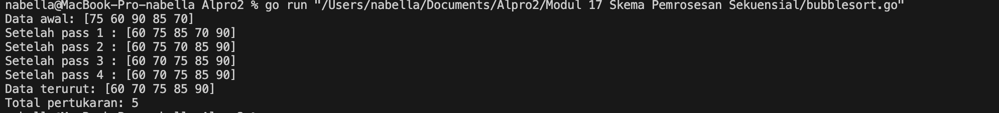
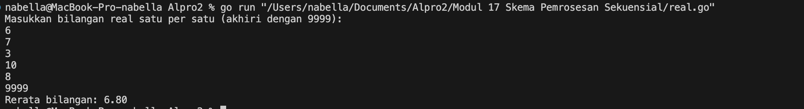
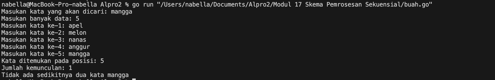
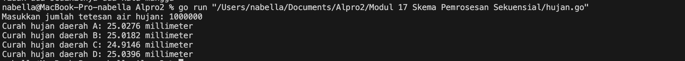
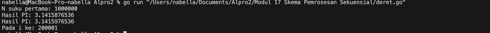
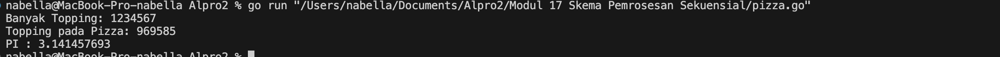

# <h1 align="center">Laporan Praktikum Modul 17<br> Skema Pemrosesan Sekuensial</h1>
<p align="center">Nabella Rahmatus Sania - 103112430002</p>

## Dasar Teori

Skema pemrosesan sekuensial adalah suatu metode pemrosesan data di mana setiap data diproses secara berurutan dari awal hingga akhir, tanpa adanya pengulangan atau percabangan ke data lain. Dalam pemrosesan ini, program membaca dan memproses data satu per satu sesuai urutan masuknya. Skema ini merupakan bentuk dasar dalam pemrograman karena mudah dipahami dan diimplementasikan. Pemrosesan sekuensial biasanya digunakan pada kasus sederhana seperti menghitung jumlah, mencari nilai maksimum, atau mencetak data secara berurutan.

---

## Guided

### Soal 1
Aldi memiliki daftar nilai ulangan matematika temannya: 75, 60, 90, 85, dan 70. Ia ingin mengurutkan nilai tersebut dari yang terkecil ke yang terbesar menggunakan metode Bubble Sort. Pertanyaan:
1. Tunjukkan proses pengurutan nilai menggunakan Bubble Sort hingga semua nilai terurut.
2. Berapa kali pertukaran (swap) terjadi dalam proses ini?

```go
package main

import (
	"fmt"
)

func main() {
	nilai := []int{75, 60, 90, 85, 70}
	jumlahSwap := 0

	fmt.Println("Data awal:", nilai)

	n := len(nilai)
	for i := 0; i < n-1; i++ {
		for j := 0; j < n-1-i; j++ {
			if nilai[j] > nilai[j+1] {
				nilai[j], nilai[j+1] = nilai[j+1], nilai[j]
				jumlahSwap++
			}
		}
		fmt.Println("Setelah pass", i+1, ":", nilai)
	}

	fmt.Println("Data terurut:", nilai)
	fmt.Println("Total pertukaran:", jumlahSwap)
}

```

Output
> 

Program ini ditulis menggunakan bahasa Go dan bertujuan untuk mengurutkan sekumpulan nilai menggunakan algoritma Bubble Sort, sekaligus menghitung berapa kali terjadi pertukaran nilai selama proses tersebut. Data awal disimpan dalam slice nilai, yang berisi lima angka: 75, 60, 90, 85, dan 70. Program menggunakan dua perulangan bersarang untuk membandingkan setiap pasangan angka yang berdekatan. Jika angka yang di kiri lebih besar daripada yang di kanan, maka keduanya ditukar, dan setiap pertukaran dicatat dengan menambahkan nilai pada variabel jumlahSwap. Setelah setiap putaran (pass), program menampilkan kondisi nilai yang sedang dalam proses pengurutan agar pengguna bisa melihat perubahan secara bertahap. Setelah semua perulangan selesai, program mencetak data yang sudah terurut dari kecil ke besar, serta jumlah total pertukaran yang telah dilakukan. Pendekatan ini sederhana dan cocok untuk memahami konsep dasar pengurutan data.

---
## Unguided
### Soal 1
Diberikan sejumlah bilangan real yang diakhiri dengan marker 9999, cari rerata dari bilanganbilangan tersebut.

```go
package main

import (
	"fmt"
)

func main() {
	var (
		bilangan float64
		total    float64
		jumlah   int
	)

	fmt.Println("Masukkan bilangan real satu per satu (akhiri dengan 9999):")

	for {
		fmt.Scanln(&bilangan)

		if bilangan == 9999 {
			break
		}

		total += bilangan
		jumlah++
	}

	if jumlah == 0 {
		fmt.Println("Tidak ada bilangan yang dimasukkan.")
	} else {
		rerata := total / float64(jumlah)
		fmt.Printf("Rerata bilangan: %.2f\n", rerata)
	}
}
```

> Output
> 

Program ini dibuat untuk menghitung rata-rata dari sejumlah bilangan real yang dimasukkan oleh pengguna. Pengguna diminta untuk memasukkan angka satu per satu, dan proses akan terus berlangsung sampai pengguna memasukkan angka khusus 9999 sebagai tanda berhenti. Setiap angka yang dimasukkan (selain 9999) akan dijumlahkan dan dihitung banyaknya. Setelah selesai, program akan mengecek apakah ada angka yang dimasukkan. Jika tidak ada, akan muncul pesan bahwa tidak ada bilangan yang dimasukkan. Namun jika ada, program akan menghitung rata-rata dari angka-angka tersebut dan menampilkannya dengan dua angka di belakang koma.
### Soal 2
Diberikan string x dan n buah string. x adalah data pertama yang dibaca, n adalah data bilangan yang dibaca kedua, dan n data berikutnya adalah data string. Buat algoritma untuk menjawab pertanyaan berikut: 
1. Apakah string x ada dalam kumpulan n data string tersebut? 
2. Pada posisi ke berapa string x tersebut ditemukan?
3. Ada berapakah string x dalam kumpulan n data string tersebut? 
4. Adakah sedikitnya dua string x dalam n data string tersebut?

```go
package main

import (
	"fmt"
)

func main() {
	var x string
	var n int

	fmt.Print("Masukan kata yang akan dicari: ")
	fmt.Scanln(&x)

	fmt.Print("Masukan banyak data: ")
	fmt.Scanln(&n)

	jumlah := 0
	posisi := []int{}
	var kata string

	for i := 1; i <= n; i++ {
		fmt.Printf("Masukan kata ke-%d: ", i)
		fmt.Scanln(&kata)

		if kata == x {
			jumlah++
			posisi = append(posisi, i)
		}
	}

	if jumlah > 0 {
		fmt.Print("Kata ditemukan pada posisi: ")
		for i, p := range posisi {
			if i > 0 {
				fmt.Print(", ")
			}
			fmt.Print(p)
		}
		fmt.Println()
	} else {
		fmt.Println("Kata tidak ditemukan.")
	}

	fmt.Printf("Jumlah kemunculan: %d\n", jumlah)

	if jumlah >= 2 {
		fmt.Printf("Ada sedikitnya dua kata %s\n", x)
	} else {
		fmt.Printf("Tidak ada sedikitnya dua kata %s\n", x)
	}
}
```

> Output
> 

Program ini berfungsi untuk mencari dan menghitung berapa kali sebuah kata muncul dalam sekumpulan data yang dimasukkan oleh pengguna. Pertama, pengguna diminta memasukkan kata yang ingin dicari, lalu jumlah total kata yang akan dimasukkan. Setelah itu, program meminta pengguna untuk memasukkan kata satu per satu sebanyak jumlah yang telah ditentukan. Jika kata yang dimasukkan sama dengan kata yang dicari, maka program akan mencatat posisi kemunculannya dan menambah jumlah kemunculan. Setelah semua data dimasukkan, program akan menampilkan posisi di mana kata tersebut ditemukan, total jumlah kemunculannya, dan memberi informasi apakah kata tersebut muncul sedikitnya dua kali atau tidak.
### Soal 3
Empat daerah A, B, C, dan D yang berdekatan ingin mengukur curah hujan. Keempat daerah tersebut digambarkan pada bidang berikut: Misal curah hujan dihitung berdasarkan banyaknya tetesan air hujan. Setiap tetesan berukuran 0.0001 ml curah hujan. Tetesan air hujan turun secara acak dari titik (0,0) sampai (1,1). Jika diterima input yang menyatakan banyaknya tetesan air hujan. Tentukan curah hujan untuk keempat daerah tersebut. Buatlah program yang menerima input berupa banyaknya tetesan air hujan. Kemudian buat koordinat/titik (x, y) secara acak dengan menggunakan fungsi rand.Float64(). Hitung dan tampilkan banyaknya tetesan yang jatuh pada daerah A, B, C dan D. Konversikan satu tetesan berukuran 0.0001 milimeter.

```go
package main

import (
	"fmt"
	"math/rand"
	"time"
)

func main() {
	var jumlahTetes int
	const volumeTetes = 0.0001

	fmt.Print("Masukkan jumlah tetesan air hujan: ")
	fmt.Scanln(&jumlahTetes)

	rand.Seed(time.Now().UnixNano())

	var countA, countB, countC, countD int

	for i := 0; i < jumlahTetes; i++ {
		x := rand.Float64() 
		y := rand.Float64()

		if x <= 0.5 && y <= 0.5 {
			countA++
		} else if x > 0.5 && y <= 0.5 {
			countB++
		} else if x > 0.5 && y > 0.5 {
			countC++
		} else if x <= 0.5 && y > 0.5 {
			countD++
		}
	}

	curahA := float64(countA) * volumeTetes
	curahB := float64(countB) * volumeTetes
	curahC := float64(countC) * volumeTetes
	curahD := float64(countD) * volumeTetes

	fmt.Printf("Curah hujan daerah A: %.4f millimeter\n", curahA)
	fmt.Printf("Curah hujan daerah B: %.4f millimeter\n", curahB)
	fmt.Printf("Curah hujan daerah C: %.4f millimeter\n", curahC)
	fmt.Printf("Curah hujan daerah D: %.4f millimeter\n", curahD)
}
```

> Output
> 

Program ini digunakan untuk mensimulasikan penyebaran tetesan air hujan secara acak di empat daerah (A, B, C, dan D) dalam sebuah bidang datar berukuran 1x1 satuan. Pengguna diminta memasukkan jumlah total tetesan air hujan, kemudian program secara acak menentukan posisi jatuhnya tiap tetesan menggunakan koordinat acak (x, y) antara 0 dan 1. Berdasarkan posisi ini, tetesan dikategorikan ke salah satu dari empat daerah: A (kiri bawah), B (kanan bawah), C (kanan atas), dan D (kiri atas). Setiap tetesan memiliki volume tetap, dan program menghitung serta menampilkan total curah hujan (dalam milimeter) untuk masing-masing daerah.
### Soal 4
Berdasarkan formula Leibniz, nilai π dapat dinyatakan sebagai deret harmonik ganti sebagai berikut:
1 − 1/3 + 1/5 − 1/7 + 1/9 − ⋯ = phi/4 Suku ke-i dinyatakan sebagai 𝑆𝑖 dan jumlah deret adalah 𝑆. Apabila diketahui suku pertama 𝑆1 = 1, suku kedua 𝑆2 = −1/3 . Temukan rumus untuk suku ke-𝒊 atau 𝑆𝑖 . Berdasarkan rumus tersebut, buatlah program yang menghitung 𝑆 untuk 1000000 suku pertama.

```go
package main

import (
	"fmt"
	"math"
)

func main() {
	var n int
	fmt.Print("N suku pertama: ")
	fmt.Scan(&n)

	pi := 0.0
	sebelumnya := 0.0

	for i := 0; i < n; i++ {
		suku := 1.0 / float64(2*i+1)

		if i%2 == 0 {
			pi += suku
		} else {
			pi -= suku
		}

		hasilPI := pi * 4

		selisih := math.Abs(hasilPI - sebelumnya)
		if i > 0 && selisih < 0.00001 {
			fmt.Printf("Hasil PI: %.10f\n", sebelumnya)
			fmt.Printf("Hasil PI: %.10f\n", hasilPI)
			fmt.Printf("Pada i ke: %d\n", i+1)
			break
		}

		sebelumnya = hasilPI
	}
}
```

> Output
> 

Program ini menghitung pendekatan nilai π (pi) menggunakan deret matematika Leibniz sebanyak n suku pertama. Pengguna diminta memasukkan jumlah suku (n) yang ingin dihitung. Deret ini bekerja dengan cara menjumlahkan dan mengurangkan pecahan secara bergantian: 1 - 1/3 + 1/5 - 1/7 + ... dan seterusnya. Hasil dari penjumlahan ini dikalikan 4 untuk mendapatkan pendekatan nilai π. Selama proses perhitungan, program juga memeriksa apakah selisih antara hasil π saat ini dengan hasil sebelumnya sudah sangat kecil (kurang dari 0.00001). Jika ya, maka program menghentikan perhitungan dan menampilkan dua hasil terakhir beserta pada suku keberapa itu terjadi. 
### Soal 5
Monti bekerja pada sebuah kedai pizza, saking ramainya kedai tersebut membuat Monti tidak ada waktu untuk bersantai. Suatu ketika saat sedang menaburkan topping pada pizza yang diletakkan pada wadah berbentuk persegi, terpikirkan oleh Monti cara menghitung berapa banyak topping yang dia butuhkan, dan cara menghitung nilai 𝝅.

```go
package main

import (
	"fmt"
	"math"
	"math/rand"
	"time"
)

func main() {
	var totalTopping int
	fmt.Print("Banyak Topping: ")
	fmt.Scan(&totalTopping)

	rand.Seed(time.Now().UnixNano())

	xCenter := 0.5
	yCenter := 0.5
	radius := 0.5
	countInside := 0

	for i := 0; i < totalTopping; i++ {
		x := rand.Float64()
		y := rand.Float64()

		if math.Pow(x-xCenter, 2)+math.Pow(y-yCenter, 2) <= radius*radius {
			countInside++
		}
	}

	pi := 4.0 * float64(countInside) / float64(totalTopping)

	fmt.Printf("Topping pada Pizza: %d\n", countInside)
	fmt.Printf("PI : %.9f\n", pi)
}
```

> Output
> 

Program ini digunakan untuk menebak nilai π (pi) dengan cara mensimulasikan penempatan topping pada pizza. Pengguna memasukkan berapa banyak topping yang ingin dijatuhkan secara acak di atas bidang kotak. Di tengah kotak itu ada lingkaran (seperti pizza). Program akan menghitung berapa banyak topping yang jatuh ke dalam lingkaran. Semakin banyak topping yang digunakan, tebakan nilai π akan semakin mendekati nilai aslinya. Hasil akhirnya akan menampilkan berapa banyak topping yang masuk ke dalam lingkaran dan berapa nilai π yang berhasil ditebak.