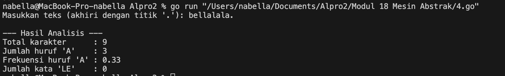

# <h1 align="center">Laporan Praktikum Modul 18<br> Mesin Abstrak</h1>
<p align="center">Nabella Rahmatus Sania - 103112430002</p>

## Dasar Teori

Mesin abstrak dalam bahasa Go merupakan sebuah konsep pemrograman yang digunakan untuk memodelkan proses pembacaan data secara sistematis dan terstruktur, khususnya pada rangkaian karakter atau simbol. Mesin ini bekerja layaknya alat pembaca yang bergerak dari awal hingga akhir data dengan menggunakan serangkaian operasi dasar, seperti start() untuk memulai pembacaan dari awal, maju() untuk melanjutkan ke elemen berikutnya, cc() untuk mengambil elemen saat ini, dan eop() (end of process) untuk memeriksa apakah pembacaan telah mencapai akhir data, yang biasanya ditandai dengan simbol khusus seperti titik ('.').

---
## Unguided
### Soal 4
Implementasi mesin abstrak karakter yang bekerja terhadap untaian karakter (yang diakhiri dengan penanda titik (".") dan mempunyai sejumlah operasi dasar. a) Operasi dasar mesin karakter: ➢ Prosedur start(); yang menyiapkan mesin karakter di awal rangkaian karakter. ➢ Prosedur maju(); yang memajukan pembaca ke posisi karakter berikutnya. ➢ Fungsi eop(); yang mengembalikan nilai true apabila sudah mencapai akhir rangkaian, sampai ke penanda titik ("."). ➢ Fungsi cc(); yang mengembalikan karakter yang sedang terbaca, atau berada pada posisi pembacaan mesin. b) Dengan operasi dasar di atas buat algoritma untuk: ➢ Membaca seluruh karakter yang diberikan ke mesin karakter tersebut. ➢ Menghitung berapa banyak karakter yang terbaca. ➢ Menghitung ada berapa huruf "A" yang terbaca. ➢ Menghitung frekuensi kemunculan huruf "A" terhadap seluruh karakter terbaca. ➢ Menghitung ada berapa kata "LE" (pasangan berturutan huruf "L" dan "E") yang terbaca.

```go
package main

import (
	"bufio"
	"fmt"
	"os"
	"strings"
)
var (
	text     string 
	position int    
	char     byte  
)

func mulai() {
	position = 0
	char = text[position]
}

func maju() {
	position++
	if position < len(text) {
		char = text[position]
	}
}

func selesai() bool {
	return char == '.'
}

func karakterSekarang() byte {
	return char
}

func main() {
	reader := bufio.NewReader(os.Stdin)
	fmt.Print("Masukkan teks (akhiri dengan titik '.'): ")
	input, _ := reader.ReadString('\n')
	input = strings.TrimSpace(input)

	if !strings.HasSuffix(input, ".") {
		fmt.Println("Teks harus diakhiri dengan titik ('.').")
		return
	}

	text = input

	mulai()

	totalKarakter := 0
	jumlahA := 0
	jumlahLE := 0
	var sebelumnya byte = 0

	for !selesai() {
		current := karakterSekarang()

		totalKarakter++ 

		if current == 'A' || current == 'a' {
			jumlahA++
		}

		if (sebelumnya == 'L' || sebelumnya == 'l') && (current == 'E' || current == 'e') {
			jumlahLE++
		}

		sebelumnya = current

		maju()
	}

	frekuensiA := float64(jumlahA) / float64(totalKarakter)

	fmt.Println("\n--- Hasil Analisis ---")
	fmt.Println("Total karakter      :", totalKarakter)
	fmt.Println("Jumlah huruf 'A'    :", jumlahA)
	fmt.Printf("Frekuensi huruf 'A' : %.2f\n", frekuensiA)
	fmt.Println("Jumlah kata 'LE'    :", jumlahLE)
}
```

> Output
> 

Program ini membaca input teks dari pengguna yang diakhiri dengan titik (`.`), lalu memprosesnya satu per satu karakter menggunakan konsep mesin abstrak. Fungsi `mulai()` memulai dari awal teks, `maju()` membaca karakter berikutnya, `selesai()` mendeteksi akhir (titik), dan `karakterSekarang()` mengambil karakter saat ini. Program menghitung total karakter, jumlah huruf 'A' (besar/kecil), frekuensi kemunculan 'A', dan jumlah pasangan huruf "LE". Hasilnya kemudian ditampilkan ke layar.